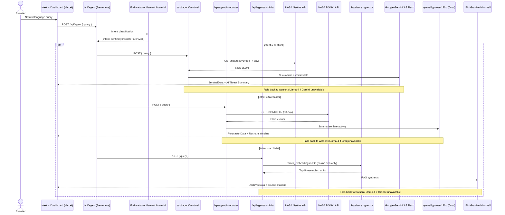
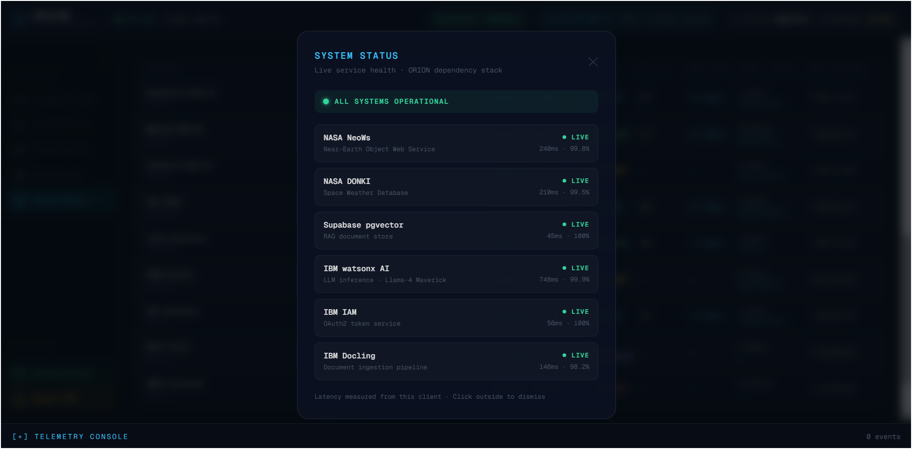

<p align="center">
  
</p>

# ORION — Orbital Research & Intelligence Orchestration Network

> **IBM AI Builders Challenge · August 2026 · Theme: Advance Space Exploration with AI**

[](https://orion-space-command.vercel.app)
[](#-sample-mission-queries)
[](https://nextjs.org)
[](https://www.ibm.com/watsonx)
[](https://supabase.com)
[](https://threejs.org)
[](https://orion-space-command.vercel.app)

**Live:** https://orion-space-command.vercel.app

---

## Selected Challenge Theme

**Advance Space Exploration with AI**

ORION directly addresses the challenge of making complex, fragmented space science data accessible and actionable through a conversational AI interface powered by IBM watsonx.

---

## Problem Statement

Space situational awareness today is a fragmented discipline. Near-Earth object tracking, solar weather forecasting, and deep astrophysics research each live in their own siloed data systems — NASA's NeoWs API, the DONKI space weather archive, and thousands of arXiv preprints — with no unified interface for a scientist, educator, or mission planner to query them all at once.

The problem is threefold:

1. **Data fragmentation.** Planetary defense data, heliophysics telemetry, and peer-reviewed research are scattered across incompatible APIs, PDFs, and web portals. Correlating them requires domain expertise and significant manual effort.
2. **Latency of insight.** Raw JSON from a NASA API is not actionable. A researcher needs synthesised, contextual summaries — not raw arrays of orbital parameters.
3. **Accessibility gap.** There is no tool that lets a developer, educator, or student ask *"Are any large asteroids approaching this week?"* or *"What does recent research say about solar flare prediction?"* and receive a coherent, cited answer in seconds.

ORION closes this gap with a single natural-language chat interface that routes each query to the right specialist agent and returns synthesised, data-backed responses in real time.

---

## Solution Description

ORION is a **Next.js mission-control command center** — a glassmorphic dark-space dashboard where a single chat input dispatches queries to three purpose-built AI agents. Each agent owns a distinct data domain and renders its results in a dedicated panel. Six navigation views expose live telemetry, historical analytics, fleet tracking, ground relay status, and orbital situational awareness — all driven by real external data sources with no mocked values anywhere.

### The Sentinel — Near-Earth Asteroid Tracker

The Sentinel agent queries the **NASA NeoWs (Near Earth Object Web Service)** API for asteroid close-approach data across a rolling 7-day window. Asteroid names, estimated diameters, miss distances, and potential-hazard (PHO) classifications are extracted, sorted by approach date, and passed to **Google Gemini 3.5 Flash** for a concise situational briefing. The panel renders an AI-generated threat summary, a scrollable asteroid table with miss distances and velocity, and a slide-out detail drawer with the raw payload and full orbital parameters for any selected object.

When a Potentially Hazardous Object is detected, the system automatically triggers a full-screen **Mitigation Banner** (`ELEVATED` → `SEVERE` → `CRITICAL` depending on miss distance and flare co-occurrence).

<p align="center">
  
  <br/>
  <em>The Sentinel panel: live NASA NeoWs asteroid approach data with AI-generated Gemini situational summary, miss-distance table, and detail drawer.</em>
</p>

---

### The Forecaster — Solar Weather Monitor

The Forecaster agent queries the **NASA DONKI (Database Of Notifications, Knowledge, Information)** API for solar flare events over the past 30 days. Flare classifications (B through X), peak times, source locations, and active region IDs are parsed into structured event cards, then synthesised by **openai/gpt-oss-120b via Groq** into a space-weather advisory. The panel renders the AI narrative summary, individual flare cards (each clickable to open the detail drawer), and **Recharts time-series charts** — a daily frequency bar chart colour-coded by severity class and a flare intensity scatter plot. A **Risk Matrix** below the Forecaster shows live satellite communications, power grid, and radiation risk bars driven by the most recent flare data.

<p align="center">
  
  <br/>
  <em>The Forecaster panel: NASA DONKI flare event cards with AI-generated Groq advisory and slide-out detail drawer showing raw flare payload.</em>
</p>

---

### The Archivist — Astrophysics Research Assistant

The Archivist is a full **Retrieval-Augmented Generation (RAG)** pipeline. A curated corpus of arXiv astrophysics PDFs — covering asteroid detection, solar flare forecasting, and exoplanetary research — was parsed offline using **IBM Docling**, chunked into 512-token segments with 64-token overlap, embedded with `sentence-transformers/all-MiniLM-L6-v2`, and persisted to a **Supabase pgvector** cloud database (939 chunks, HNSW cosine similarity index). At query time, the top-5 most relevant chunks are retrieved and passed to **IBM Granite-4-h-small** via watsonx for grounded, citation-backed answer synthesis. Answers include a trailing confidence rating (`high / medium / low`) and a list of source arXiv paper titles.

<p align="center">
  
  <br/>
  <em>The Archivist panel: natural-language answers grounded in arXiv literature with arXiv source citations and confidence rating.</em>
</p>

> **Try it on the [live demo](https://orion-space-command.vercel.app)** — type any of these into the command bar and press Transmit:
>
> 🛰️ `give me a planetary defense briefing` · `which asteroid has the smallest miss distance this week?`
>
> ☀️ `have there been any X-class flares recently?` · `what's the risk to satellites from solar activity?`
>
> 📚 `what does research say about asteroid deflection?` · `explain the Torino scale`
>
> → [Full query list](#-sample-mission-queries)

---

## AI Approach & Architecture

### V1 → V2: Architectural Evolution

ORION shipped in two phases. **V1** validated the multi-agent concept using a locally-hosted Langflow pipeline as the orchestration layer, with a local Chroma vector store for the Archivist RAG. **V2** migrated to a fully serverless, cloud-native architecture with no local processes required.

| Component | V1 (Prototype) | V2 (Production) |
|-----------|---------------|-----------------|
| Agent orchestration | Langflow local server (`:7861`) | Next.js serverless API routes |
| LLM calls | Langflow watsonx node | Direct IBM watsonx REST (IAM token cached) |
| Vector store | Local Chroma DB | Supabase PostgreSQL + pgvector |
| Public access | ngrok tunnel | Vercel global edge network |
| Deploy | Manual ngrok restart + push | `git push origin main` |

### V2 Production Architecture



### V1 Langflow Flows (archived)

The V1 Langflow flows are preserved in `./langflow/flows/` for reference:

| Flow File | Role |
|-----------|------|
| `orion-router.json` | Master Router — classifies intent, dispatches to sub-agent |
| `sentinel-flow.json` | Sentinel Agent — NeoWs fetch + Maverick summary |
| `forecaster-flow.json` | Forecaster Agent — DONKI fetch + Maverick summary |
| `archivist-flow.json` | Archivist Agent — Chroma retrieval + Maverick synthesis |

### Multi-Model AI Fleet

ORION V2 distributes AI workloads across **four specialist model providers** — each agent uses the model best suited to its task, with automatic fallback to watsonx Llama-4 Maverick if a provider is unreachable.

| Agent | Primary Model | Provider | Fallback |
|-------|--------------|----------|---------|
| **Router** | `llama-4-maverick-17b-128e-instruct-fp8` | IBM watsonx | — |
| **Sentinel** | `gemini-3.5-flash` | Google AI Studio | watsonx Llama-4 |
| **Forecaster** | `openai/gpt-oss-120b` | Groq | watsonx Llama-4 |
| **Archivist RAG** | `ibm/granite-4-h-small` | IBM watsonx | watsonx Llama-4 |

- **Granite-4-h-small** was selected for Archivist RAG synthesis after live benchmarking against all available watsonx models — it produces clean, citation-aware prose from retrieved research chunks.
- **Gemini 3.5 Flash** handles Sentinel summaries for its speed on structured JSON narration.
- **openai/gpt-oss-120b via Groq** handles Forecaster solar weather narratives. The route allocates a 1024-token budget and reads from both `content` and `reasoning` fields in the response to handle any internal chain-of-thought output.
- All model calls use plain `fetch()` — no SDK packages required. Rate-limit errors (HTTP 429) are caught and surfaced as friendly messages rather than raw API errors.

### IBM Docling — PDF Ingestion Pipeline

The `./scripts/ingest_pdfs.py` script uses **IBM Docling's `DocumentConverter`** to parse arXiv PDFs into structured markdown before chunking. Docling's layout-aware parsing correctly handles multi-column academic papers, figure captions, and mathematical notation — producing higher-quality text chunks than a naive PDF text extractor.

```
arXiv PDFs (./data/pdfs/)
  +-> IBM Docling DocumentConverter -> structured markdown
        +-> 512-token chunks with 64-token overlap
              +-> sentence-transformers/all-MiniLM-L6-v2 embeddings
                    +-> Chroma PersistentClient (./data/chroma_db/)   [V1 local]
                    +-> Supabase pgvector via migrate_to_supabase.py  [V2 cloud]
```

### Structured Response Contract

Every V2 sub-agent route handler returns a consistent JSON envelope regardless of success or error:

```json
{
  "agent":      "sentinel | forecaster | archivist",
  "items":      [...],
  "summary":    "...",
  "sources":    ["..."],
  "model_used": "gemini-3.5-flash | gpt-oss-120b-groq | granite-4-h-small | fallback",
  "error":      null
}
```

The Next.js frontend reads `agent` to determine which panel to activate, renders `items` in a data table or card grid, and displays `summary` / `sources` as the AI narrative block. The `model_used` field drives the model label shown in the UI.

---

## Built with IBM Bob (Primary Development Tool)

ORION was built using **IBM Bob as the primary development tool** throughout all phases of the project — V1 prototyping through V2 cloud-native migration — functioning not as a passive code autocomplete, but as an active engineering collaborator that held full context across the entire codebase.

The architectural vision was established up front: three specialist agents, IBM watsonx as the LLM backbone, and a Next.js mission-control dashboard as the user interface. IBM Bob was then heavily utilised to translate that architecture into working, production-quality code at speed — and to drive the full V2 serverless migration.

**Specific contributions where IBM Bob was the primary tool:**

- **Next.js Frontend Scaffolding.** The full dashboard layout, all 17 components (`SentinelPanel`, `ForecasterPanel`, `ArchivistPanel`, `AnalyticsView`, `AdvancedThreatMatrix`, `ConstellationFleet`, `MissionActivityLog`, `GroundRelayGrid`, `KpStatusBanner`, `MitigationBanner`, `RiskMatrix`, `OrbitalCanvas`, `FlareChart`, `DetailPanel`, `Sidebar`, `SystemStatusModal`, `TelemetryConsole`), loading skeletons, idle state animations (radar sweep, waveform pulse, document scan), and the glassmorphic dark-space Tailwind theme were prototyped iteratively with Bob. The complete UI — including the telemetry console, slide-out detail drawer, navigation rail, and six distinct views — was assembled across extended sessions.

- **Langflow Async Stream Debugging (V1).** Resolving the async conflict between Langflow's LLM nodes and custom Python components required understanding both the Langflow 1.11 internal component lifecycle and the Next.js server-side fetch model. IBM Bob diagnosed the root cause, identified the correct `outputs[0].outputs[0].results.message.text` extraction path in the Langflow response envelope, and rebuilt the two-phase routing architecture with a JSON repair fallback.

- **Python API Integrations.** The custom Langflow Python components for the Sentinel (flattening the nested `near_earth_objects[date][]` NeoWs structure), the Forecaster (handling DONKI null responses for quiet solar periods), and the Archivist (Chroma top-k retrieval with metadata) were all written and debugged with Bob. The `ingest_pdfs.py` pipeline — Docling conversion, 512-token chunking with overlap, sentence-transformer embedding, and Chroma persistence — was written and validated end-to-end within the same session.

- **V2 Serverless Migration.** IBM Bob drove the complete architectural migration from Langflow to Next.js serverless route handlers with direct IBM watsonx REST integration, including IAM token caching, intent routing prompt engineering, robust JSON extraction with multi-fallback parsing, and output sanitisation to strip chain-of-thought artifacts.

- **Supabase pgvector Pipeline.** The full cloud RAG migration — PostgreSQL schema design, HNSW index configuration, `match_embeddings` cosine similarity RPC, and the `migrate_to_supabase.py` script that transferred 939 embedded chunks from local Chroma to Supabase — was designed and implemented with Bob.

- **3D Orbital Canvas & Solar Charts.** The Three.js / React Three Fiber interactive asteroid trajectory visualisation (`OrbitalCanvas.tsx`) and the Recharts solar flare time-series charts (`FlareChart.tsx`) were built with Bob, including the miss-distance-to-scene-unit mapping, Bezier trajectory arcs, and severity-colour-coded scatter plots.

- **Multi-Model AI Fleet & Groq Integration.** The Groq (`openai/gpt-oss-120b`) integration for the Forecaster — including live diagnosis of the `content`/`reasoning` response shape and the 1024-token budget requirement — was diagnosed and fixed with Bob. The Gemini 3.5 Flash helper for the Sentinel and the Granite-4-h-small RAG synthesis path were also implemented collaboratively.

- **Model Benchmarking.** The `scripts/test_model_candidates.py` benchmarking script was written with Bob to systematically evaluate available IBM watsonx models against the production routing prompt before committing to a model choice.

- **Project Infrastructure.** The phased development plans (`docs/plan.md`, `docs/v2-plan.md`, `docs/upgrade-plan.md`), `.env.example` hygiene, `.gitignore` configuration, Vercel deployment troubleshooting, and environment variable management were all handled collaboratively with Bob.

---

## Setup & Deployment

### Prerequisites

| Requirement | Version |
|-------------|---------|
| Node.js | 22.x |
| Python | 3.10 or later (scripts only) |

---

### 1. Clone the repository

```bash
git clone https://github.com/primegideon/orion-space-command.git
cd orion-space-command
```

### 2. Install frontend dependencies

```bash
cd frontend
npm install
```

### 3. Configure environment variables

```bash
cp .env.example frontend/.env.local
```

Edit `frontend/.env.local` with your credentials:

```env
# IBM watsonx.ai — https://dataplatform.cloud.ibm.com
WATSONX_API_KEY=your_ibm_cloud_api_key
WATSONX_PROJECT_ID=your_watsonx_project_id
WATSONX_URL=https://us-south.ml.cloud.ibm.com

# NASA Open APIs — https://api.nasa.gov (free)
NASA_API_KEY=your_nasa_api_key

# Supabase pgvector — https://supabase.com
NEXT_PUBLIC_SUPABASE_URL=https://your-project.supabase.co
SUPABASE_SERVICE_ROLE_KEY=your_supabase_service_role_key

# Google AI Studio (Gemini 3.5 Flash) — https://aistudio.google.com/app/apikey
# Used by Sentinel for NL summaries — falls back to watsonx if absent
GEMINI_API_KEY=your_google_ai_studio_api_key

# Groq (openai/gpt-oss-120b) — https://console.groq.com/keys
# Used by Forecaster for NL summaries — falls back to watsonx if absent
GROQ_API_KEY=your_groq_api_key
```

> **Note:** `GEMINI_API_KEY` and `GROQ_API_KEY` are optional — if absent, those agents fall back to watsonx Llama-4 automatically. There are no Langflow or ngrok variables in V2 — those were V1 only.

### 4. Set up Supabase (one-time)

1. Create a project at **https://supabase.com**
2. In **SQL Editor**, paste and run [`scripts/supabase_schema.sql`](./scripts/supabase_schema.sql)
3. Run the migration to populate the vector store:

```powershell
# Windows PowerShell — activate venv first
.\.venv\Scripts\Activate.ps1
$env:SUPABASE_URL = "https://your-project.supabase.co"
$env:SUPABASE_SERVICE_ROLE_KEY = "your-service-role-key"
python scripts/migrate_to_supabase.py
```

### 5. Start the development server

```bash
cd frontend
npm run dev
```

Dashboard available at **http://localhost:3000**.

---

### Vercel Deployment

1. Connect the repository at **https://vercel.com/new** → Import `primegideon/orion-space-command`
2. Set **Root Directory** to `frontend`
3. Set **Node.js Version** to `22.x`
4. Add all environment variables under **Settings → Environments**:

| Variable | Required | Description |
|----------|----------|-------------|
| `WATSONX_API_KEY` | ✅ | IBM Cloud API key |
| `WATSONX_PROJECT_ID` | ✅ | watsonx.ai project ID |
| `WATSONX_URL` | ✅ | `https://us-south.ml.cloud.ibm.com` |
| `NASA_API_KEY` | ✅ | NASA Open APIs key (free at api.nasa.gov) |
| `NEXT_PUBLIC_SUPABASE_URL` | ✅ | Supabase project URL |
| `SUPABASE_SERVICE_ROLE_KEY` | ✅ | Supabase service role key |
| `GEMINI_API_KEY` | ⚡ optional | Google AI Studio key — Sentinel uses Gemini 3.5 Flash; falls back to watsonx if absent |
| `GROQ_API_KEY` | ⚡ optional | Groq API key — Forecaster uses `openai/gpt-oss-120b`; falls back to watsonx if absent |

5. Push to `main` — Vercel auto-deploys on every commit. No ngrok, no local processes required.

---

## Live Data Feeds

Every dashboard panel is driven by a real external data source — no mocked or static data anywhere in the system.

| Panel | Route | Source | Cadence |
|-------|-------|--------|---------|
| Orbital Debris & Drag | `/api/satellites` + `/api/kp` | CelesTrak satcat + NOAA Kp index | 10 min |
| Solar Wind | `/api/solarwind` | NOAA SWPC DSCOVR RTSW mag + plasma | 60 s |
| RF / Spectrum Risk | derived from Kp + flare data | NOAA Kp + NASA DONKI | live |
| Ground Relay Map | `/api/dsn` + `/api/satnogs` | NASA DSN XML feed + SatNOGS Network API | 15 s / 5 min |
| Constellation Fleet | `/api/satellites` + `/api/tle` | CelesTrak satcat + TLE SGP4 propagation | 10 min / 10 min |
| Orbit Viewer | `/api/horizons` | NASA JPL Horizons ephemeris | per-request |
| Sentinel NEOs | `/api/agent/sentinel` → NASA NeoWs | NASA NeoWs 7-day feed | on query |
| Forecaster Flares | `/api/agent/forecaster` → NASA DONKI | NASA DONKI 30-day FLR feed | on query |

**SatNOGS streaming strategy:** The SatNOGS API returns a ~2.8 MB plain array of all stations. Rather than downloading the full payload, the `/api/satnogs` route streams the response, parses station objects as chunks arrive, and cancels the connection once 300 online candidates are collected. These are then spread across 5 longitude bands to ensure a globally distributed map — avoiding the European cluster that results from taking the first N by station ID.

---

## Project Structure

```
orion-space-command/
+-- assets/                              # Screenshots and project logo
|   +-- orion-animated-logo.svg          # Project logo (SVG, animated)
+-- frontend/                            # Next.js 14 app (TypeScript + Tailwind CSS)
|   +-- src/app/
|   |   +-- page.tsx                     # Main dashboard page + view router
|   |   +-- layout.tsx                   # Root layout + global fonts
|   |   +-- globals.css                  # Tailwind base + CSS custom properties
|   |   +-- api/agent/
|   |   |   +-- route.ts                 # Master intent router (keyword + watsonx)
|   |   |   +-- sentinel/route.ts        # NeoWs fetch + Gemini summary
|   |   |   +-- forecaster/route.ts      # DONKI fetch + Groq (gpt-oss-120b) summary
|   |   |   +-- archivist/route.ts       # Supabase pgvector RAG + Granite synthesis
|   |   +-- api/analytics/route.ts       # 30-day flare/CME/NEO analytics aggregator
|   |   +-- api/donki/route.ts           # Live NOAA DONKI flare + R-Scale feed
|   |   +-- api/dsn/route.ts             # NASA Deep Space Network XML parser
|   |   +-- api/horizons/route.ts        # NASA JPL Horizons ephemeris endpoint
|   |   +-- api/kp/route.ts              # NOAA SWPC planetary Kp-index feed
|   |   +-- api/logs/route.ts            # Supabase system_logs reader
|   |   +-- api/satellites/route.ts      # CelesTrak satcat orbital parameters
|   |   +-- api/satnogs/route.ts         # SatNOGS Network ground station feed
|   |   +-- api/solarwind/route.ts       # NOAA DSCOVR real-time solar wind
|   |   +-- api/tle/route.ts             # CelesTrak TLE + SGP4 propagation
|   +-- src/components/
|   |   +-- SentinelPanel.tsx            # Asteroid table + AI threat summary
|   |   +-- ForecasterPanel.tsx          # Flare cards + Recharts charts
|   |   +-- ArchivistPanel.tsx           # RAG answer + source citations
|   |   +-- AnalyticsView.tsx            # 30-day historical charts + threat matrix
|   |   +-- AdvancedThreatMatrix.tsx     # Orbital debris, solar wind & RF spectrum (3-col)
|   |   +-- ConstellationFleet.tsx       # Live CelesTrak satellite fleet table
|   |   +-- MissionActivityLog.tsx       # Supabase query audit log + routing stats
|   |   +-- GroundRelayGrid.tsx          # NASA DSN world map + station table
|   |   +-- KpStatusBanner.tsx           # Live NOAA Kp status banner
|   |   +-- MitigationBanner.tsx         # Auto-triggered flare/PHO alert banner
|   |   +-- RiskMatrix.tsx               # Flare-driven sat-comms/power/radiation bars
|   |   +-- OrbitalCanvas.tsx            # Three.js / R3F asteroid trajectory scene
|   |   +-- FlareChart.tsx               # Recharts solar weather time-series charts
|   |   +-- DetailPanel.tsx              # Slide-out asteroid / flare detail drawer
|   |   +-- Sidebar.tsx                  # Navigation rail + utility buttons
|   |   +-- SystemStatusModal.tsx        # API dependency health modal
|   |   +-- TelemetryConsole.tsx         # Live session telemetry log console
|   +-- src/lib/
|   |   +-- watsonx.ts                   # IAM token cache + generateText + generateEmbedding
|   |   +-- groq.ts                      # Groq REST helper — openai/gpt-oss-120b (Forecaster primary)
|   |   +-- gemini.ts                    # Google Gemini REST helper — gemini-3.5-flash (Sentinel primary)
|   |   +-- github-models.ts             # GitHub Models REST helper — gpt-4o (utility)
|   |   +-- supabase.ts                  # Supabase admin client (service-role)
|   |   +-- exportPdf.ts                 # Client-side PDF mission briefing generator
+-- langflow/                            # V1 flows (archived for reference)
|   +-- flows/
|   +-- components/                      # V1 custom Python components
+-- scripts/
|   +-- supabase_schema.sql              # pgvector schema + match_embeddings RPC
|   +-- migrate_to_supabase.py           # One-time Chroma → Supabase migration
|   +-- ingest_pdfs.py                   # One-time Docling → Chroma ingestion (V1)
|   +-- download_pdfs.py                 # arXiv PDF bulk downloader
|   +-- test_model_candidates.py         # watsonx model benchmarking
|   +-- test_watsonx.py                  # watsonx connectivity test
|   +-- test_nasa_apis.py                # NASA API connectivity test
|   +-- test_langflow.py                 # V1 Langflow integration test
|   +-- _gen_flows.py                    # V1 flow scaffolding helper
|   +-- _verify_chroma.py                # V1 Chroma vector store verifier
|   +-- _verify_flows.py                 # V1 Langflow flow verifier
+-- docs/
|   +-- plan.md                          # V1 phased development plan (archived)
|   +-- v2-plan.md                       # V2 cloud-native engineering roadmap
|   +-- upgrade-plan.md                  # Multi-model AI fleet & live data upgrade plan
+-- data/
|   +-- pdfs/                            # arXiv source PDFs
|   +-- chroma_db/                       # Local Chroma vector store (V1)
|   +-- README.md                        # PDF sources and arXiv IDs
+-- requirements.txt                     # Python dependencies
+-- .env.example                         # Environment variable template
+-- LICENSE                              # MIT License
```

---

## 📖 How to Use & Read This System

ORION is a multi-view aerospace command terminal designed for space scientists, mission planners, satellite operators, educators, and space-tech developers who need live situational awareness and research synthesis in one place.

---

### The Global Header

<p align="center">
  
  <br/>
  <em>The primary command view on load — three idle agent panels with radar sweep, waveform, and document-scan animations. The header shows live uplink, status, UTC clock, MET, operator ID, and clearance level.</em>
</p>

The persistent top bar shows the complete mission status at a glance:

- **UPLINK: GLOBAL DSN-01** — active ground relay node. Green pulse = connected, reflecting the live NASA DSN feed.
- **STATUS badge** — system-wide threat level: `NOMINAL` (green) → `ELEVATED` (amber) → `STORM` (orange) → `SEVERE` (red). Driven by live NOAA Kp index and active Mitigation Banner triggers.
- **UTC clock + MET** — live UTC time and Mission Elapsed Time counting from mission epoch (2025-01-01T00:00:00Z).
- **OP-ID / CLEARANCE** — operator ID and clearance level for the current session.
- **IBM WATSONX: ONLINE [latency]ms** — live watsonx API ping result shown on the Threat & Risk view.

---

### Voice & Text Command Bar

The full-width input bar is the primary interface. Type or speak any natural-language query and press **Transmit**:

- **Text input** — free-form natural language. Typos, informal phrasing, and partial queries all work. The master router runs a fast keyword classifier before calling watsonx, so most queries route with near-zero LLM latency.
- **Voice input** — click the microphone icon to activate the Web Speech API (Chrome/Edge). Speak your query and it transcribes directly into the bar.
- **Auto-routing** — never select which agent to call. `"show asteroids"` → Sentinel. `"any flares recently?"` → Forecaster. `"what does research say about kinetic impactors?"` → Archivist.

---

### Navigation Rail (Left Sidebar)

Click the `‹` chevron to expand or collapse. Six views are available:

---

#### 🛰 Telemetry Core — Primary Live Dashboard

The default view. Three agent panels side-by-side, each with idle animations while awaiting a query:

**Sentinel** (left) — Radar sweep at idle. After a NEO query:
- AI-generated threat summary (Gemini 3.5 Flash): total asteroid count, closest approach, PHO flags
- Scrollable table: name, close approach date, miss distance (km), diameter (km), velocity (km/h), hazard flag
- Click any row → **Detail Panel** slide-out: full orbital parameters and raw payload JSON
- Click **JPL DATA** on any row → opens the NASA JPL Small-Body Database entry for that asteroid in a new tab

**Forecaster** (centre) — Waveform pulse at idle. After a solar weather query:
- AI-generated advisory (openai/gpt-oss-120b via Groq): flare count, peak class, operational risk
- Flare event cards: class badge (B/C/M/X colour-coded), begin→peak→end times, source location, active region
- Click any card → **Detail Panel** with full flare JSON payload
- **Risk Matrix** below: three live bars — Satellite Communications, Power Grid, Radiation Exposure — driven by the current flare class and Kp

**Archivist** (right) — Document-scan at idle; shows "939 chunks indexed". After a research query:
- AI-synthesised answer (IBM Granite-4-h-small): grounded strictly in retrieved arXiv chunks
- Source list: arXiv paper titles used for synthesis
- Confidence badge: `HIGH` (green) / `MEDIUM` (amber) / `LOW` (red)

**Mitigation Banner** — Auto-triggers on X-class / M5+ flare or PHO detection:
- `WATCH` → `ELEVATED` → `SEVERE` → `CRITICAL` (escalates when flare + asteroid trigger simultaneously)
- Shows specific trigger: asteroid name, miss distance, flare class
- Dismissible with ×; reappears on each new query if conditions persist

---

#### ⚡ Threat & Risk — Historical Analytics + Advanced Threat Matrix

Two sub-tabs: **Historical** and **Threat Matrix**.

<p align="center">
  
  <br/>
  <em>Historical tab: live NOAA Kp banner (NOMINAL, Kp 0.3), 30-day summary metrics (13 flares, 0 X-class, 1862 km/s peak CME, 20 PHO approaches), Recharts flare frequency line chart (B/C/M/X classes), and Risk Radar comparing live telemetry against historical baselines.</em>
</p>

**Historical tab** — 30-day aggregates from NASA DONKI + NeoWs:
- **Kp Status Banner** — live NOAA Kp with geomagnetic status (NOMINAL / ELEVATED / STORM / SEVERE), Kp value, timestamp, 24-hour sparkline
- **Summary metrics** — 30-day flare count, X-class count, peak CME speed (km/s), PHO approach count
- **Flare Frequency chart** — Recharts line chart: daily event counts per class (B=grey, C=yellow, M=orange, X=red) over 30 days. Hover for date + count + peak class.
- **Risk Radar** — multi-axis radar chart: live telemetry (blue) vs historical baseline (amber dashed) across X-Flare, CME, PHO, GeoMag, Radiation axes

<p align="center">
  
  <br/>
  <em>Historical tab (scrolled): 30-day CME propagation speed bar chart (peak 1,862 km/s) and Standard Mitigation Protocols — HF Radio Blackout Response and PHO Proximity Alert both ACTIVE based on live DONKI data.</em>
</p>

Scrolling further reveals:
- **CME Propagation Speed chart** — 30-day bar chart of CME speeds (km/s) from DONKI
- **Standard Mitigation Protocols** — four rule-based cards that activate automatically:
  - *Radiation Shielding Protocol* — X-class flare or S3+ event
  - *HF Radio Blackout Response* — R3+ radio blackout (M5+ flare)
  - *PHO Proximity Alert* — any PHO in 30-day close-approach window
  - *Geomagnetic Storm Prep* — Kp ≥ 5

**Why it matters:** A single solar flare reading or asteroid approach number tells you nothing without context. The Historical tab exists to answer "is this normal?" — surfacing whether today's Kp reading is routine or an outlier, whether this month's flare count is elevated relative to the baseline, and whether the current PHO window is busier than usual. The Mitigation Protocols translate that context into concrete actions: they fire automatically when thresholds are crossed, so operators don't have to remember what an R3 blackout means for HF communications — the system tells them what to do.

<p align="center">
  
  <br/>
  <em>Threat Matrix tab: three equal-width live heuristic modules — Orbital Debris & Drag (CelesTrak + Kp), Cybersecurity & Spectrum (DONKI R-Scale + ITU bands), Solar Wind (NOAA DSCOVR RTSW).</em>
</p>

**Threat Matrix tab** — three live modules side-by-side:

*Orbital Debris & Drag* (left) — CelesTrak satcat + NOAA Kp:
- Current Kp + thermospheric drag density multiplier
- Per-satellite cards (ISS, CSS, HST, GPS, GOES, Landsat…): altitude, period, inclination, computed drag (×10⁻⁷ m/s²), status

*Cybersecurity & Spectrum* (centre) — DONKI R-Scale telemetry:
- Live Kp + DONKI R-Scale (R0–R5)
- Recent DONKI flare events (7-day) with R-Scale badges
- RF Spectrum Load per ITU band (UHF, L-band, S-band, X-band, Ka-band): load % and NOMINAL / ELEVATED / DEGRADED / CONGESTED

*Solar Wind* (right) — NOAA DSCOVR RTSW, updated every 60 s:
- **Bz (nT)** — interplanetary magnetic field z-component. Negative (southward) Bz drives geomagnetic storms
- **|Bt| (nT)** — total magnetic field
- **ρ (p/cm³)** — proton density
- **V (km/s)** — solar wind speed
- Visual Bz gauge bar and Geomagnetic Impact Assessment

**Why it matters:** The Threat Matrix answers a question no single NASA feed can: "what is the combined operational risk right now?" Orbital drag tells satellite operators whether their station-keeping budget is being eaten by a geomagnetic storm. The RF spectrum module tells ground station engineers which frequency bands are degraded before they attempt an uplink. The Solar Wind panel tells space weather analysts whether incoming Bz is southward — the key precursor to a geomagnetic storm — minutes before it arrives. Together, these three panels give a holistic threat picture that previously required three separate expert tools.

---

#### 🛰 Constellation — Satellite Fleet Monitor

<p align="center">
  
  <br/>
  <em>Constellation Fleet: 12 curated satellites across LEO/MEO/GEO/HEO. Live CelesTrak satcat data. Band filter buttons top-right (LEO / MEO / GEO / HEO).</em>
</p>

12 curated satellites sourced live from CelesTrak satcat + TLE SGP4 propagation:

- **Band filter** — top-right buttons: LEO / MEO / GEO / HEO
- **Columns** — Satellite / NORAD ID, Band (colour-coded), Altitude (km) · Inclination (°), Period (min), Altitude bar
- **Satellites** — ISS, CSS (TIANHE), HST, NOAA 20, GOES 16, GOES 18, Landsat 9, GPS IIF-10, GPS III SV04, Galileo FOC-7, IRIDIUM 180, SES-1
- **Live TLE propagation** — SGP4 gives real-time sub-satellite lat/lon and velocity

**Why it matters:** When the Threat Matrix shows elevated Kp or X-class flares, operators need to know which satellites are currently in exposed orbits. The Constellation view lets you immediately cross-reference which LEO and GEO assets are at altitude during a solar or geomagnetic event, informing safing procedures, antenna stow decisions, and insurance exposure assessments. **Relevant for:** Satellite operators, space insurance actuaries, and orbital analysts.

---

#### 📋 Mission Log — Query Audit Trail

<p align="center">
  
  <br/>
  <em>Mission Log: live Supabase system_logs — 67 total queries, 11.4s avg latency, 67.2% routing success rate. Each row shows query text, route path, agent, latency, and status. PHO mitigation banner active above.</em>
</p>

Every AI query persisted to Supabase `system_logs`:

- **Summary metrics** — Total Queries, Avg Latency, Routing Success Rate, Errors
- **Filter** — All Agents / Sentinel / Forecaster / Archivist
- **Table** — Timestamp (UTC), Query, Route path (`router → sentinel → NeoWs`), Agent badge, Latency, Status (OK / WARN / ERROR)
- **Telemetry Console** — collapsible bottom bar logging every client-side event in real time

**Why it matters:** Every query ORION processes is a decision a human is about to act on. The Mission Log provides a durable, timestamped record of what was asked, which agent answered, how fast it responded, and whether it succeeded — giving mission teams an audit trail for post-event review, and giving developers a live debugging surface when integrating ORION into a larger workflow. **Relevant for:** Developers debugging routing, researchers tracking query history, mission commanders reviewing activity logs.

---

#### 📡 Ground Relay — Deep Space Network Monitor

<p align="center">
  
  <br/>
  <em>Ground Relay Grid: equirectangular SVG map of global DSN complexes (Goldstone, Madrid, Canberra). Live NASA DSN XML feed refreshed every 15 seconds. Green = active, amber = standby.</em>
</p>

<p align="center">
  
  <br/>
  <em>DSN dish table: Goldstone complex — DSS26 actively tracking Juno at 931 Gkm with X-band downlink at 26.0 kbps. DSS23 on standby for LUCY. DSS24 on standby for SOHO.</em>
</p>

Live telemetry from the NASA DSN XML feed, refreshed every 15 seconds:

- **Summary strip** — Active dishes, Standby, Maintenance, Active craft, Total downlink Mbps
- **Active spacecraft badges** — real identifiers: JNO (Juno), MRO (Mars Reconnaissance Orbiter), TGO (ExoMars), PSYC (Psyche), VGR1 (Voyager 1), etc.
- **World map** — SVG equirectangular projection with pulsing status dots
- **Dish table** — per-complex, per-dish: DSS ID, status, elevation/azimuth, spacecraft, signal type, data rate, range (Gkm)
- **SatNOGS overlay** — community ground stations augment the map with global coverage

**Why it matters:** Solar events don't just affect satellites — they affect the ground antennas trying to communicate with them. When the Forecaster reports an M-class flare, the Ground Relay view lets you immediately see which DSN dishes are actively tracking spacecraft and whether any uplink/downlink sessions are at risk. It contextualises space weather as an operational ground-segment problem, not just an abstract metric. **Relevant for:** Mission controllers, deep space communication engineers, and space enthusiasts tracking real spacecraft contacts.

---

#### 🌍 Orbit Viewer — Situational Awareness Hub

<p align="center">
  
  <br/>
  <em>Orbit Viewer: NASA Eyes on the Solar System live 3D visualization (Earth, Venus, Mars, Parker Solar Probe, Europa Clipper). Target list: 20 current NEOs. Active target 2005 PJ2 (PHO) selected — miss distance 7,077,379 km.</em>
</p>

Dual-panel situational awareness:

- **NASA Eyes on the Solar System** — an interactive 3D heliocentric simulation built and maintained by NASA/JPL, embedded directly into ORION. It shows real planetary positions, active NASA spacecraft, and the current solar system geometry. It is a NASA-hosted visualisation tool — not a rendering of the asteroids detected by the Sentinel agent. Pan, zoom, and rotate freely.
- **OPEN FULL SCREEN** — launches the visualisation full-browser for presentations or detailed inspection
- **JPL ORBIT DATA** — opens the NASA JPL Small-Body Database entry for the selected asteroid in a new tab
- **Target list** — the NEOs listed here are sourced from the same NeoWs feed as the Sentinel panel; clicking one changes the Eyes view to that asteroid's approximate heliocentric position
- **PHO flag** — `○ PHO` badge on hazardous objects

**Why it matters:** Numbers on a table (miss distance: 7,077,379 km) are hard to reason about in three dimensions. The Orbit Viewer gives mission planners, educators, and science communicators an immediate spatial sense of where an approaching asteroid actually is relative to Earth and the Sun — turning a Sentinel briefing from a list of numbers into a geometry problem you can see. **Relevant for:** Planetary scientists, students, science communicators, and mission planners.

---

### Utilities (Bottom of Sidebar)

#### System Status Modal

<p align="center">
  
  <br/>
  <em>System Status: all six dependencies LIVE — NASA NeoWs (240ms, 99.8%), NASA DONKI (210ms, 99.5%), Supabase pgvector (45ms, 100%), IBM watsonx AI (748ms, 99.9%), IBM IAM (56ms, 100%), IBM Docling (146ms, 98.2%).</em>
</p>

Probes all six external API dependencies from the client:

| Service | What it checks |
|---------|---------------|
| **NASA NeoWs** | Near-Earth Object Web Service — asteroid feed |
| **NASA DONKI** | Space Weather Database — flare/CME feed |
| **Supabase pgvector** | RAG document store — vector similarity search |
| **IBM watsonx AI** | LLM inference — Llama-4 Maverick routing |
| **IBM IAM** | OAuth2 token service — watsonx auth |
| **IBM Docling** | Document ingestion pipeline — PDF parsing |

Each row shows LIVE / DEGRADED / DOWN, latency (ms), and uptime (%). Click outside to dismiss.

#### Export PDF

Generates a client-side PDF mission briefing (no server roundtrip):

- Mission timestamp and MET
- Current global threat status and active agent summary (sanitised LLM output)
- **Satellite Insurance & Financial Risk Exposure** table — modelled estimates based on publicly available industry reports (Lloyd's of London, Marsh McLennan, NOAA SWPC). Values are ranges reflecting variability by satellite density, orbit, and coverage (e.g. $30–50M/day for X-class comm disruption). Not official NASA or NOAA outputs.
- Live constellation fleet status (from `/api/satellites`)
- Orbital threat matrix with live Kp and PHO table (from `/api/kp` + last Sentinel query)
- Hardware mitigation protocol recommendations
- Full current-session telemetry console log

---

## 🧪 Sample Mission Queries

### 🛰️ Sentinel — Near-Earth Objects
- `show me asteroids approaching this week`
- `are there any potentially hazardous asteroids coming?`
- `what near-Earth objects are closest to Earth right now?`
- `show me all PHO asteroids in the next 7 days`
- `which asteroid has the smallest miss distance this week?`
- `give me a planetary defense briefing`
- `what's the largest asteroid approaching Earth soon?`
- `are any asteroids bigger than 1km coming close?`
- `show me the fastest moving asteroid this week`
- `NEO close approach data`

### ☀️ Forecaster — Solar Weather
- `solar flare activity last 30 days`
- `have there been any X-class flares recently?`
- `what's the current space weather situation?`
- `show me solar weather activity`
- `any M-class or X-class flares this month?`
- `what's the risk to satellites from solar activity?`
- `give me a solar weather briefing`
- `how active has the sun been lately?`
- `show me DONKI flare data`
- `any coronal mass ejections recently?`
- `what solar events could affect communications?`
- `is there elevated radiation risk from solar activity?`

### 📚 Archivist — Astrophysics Research RAG
- `what does research say about asteroid deflection?`
- `how do scientists predict solar flares?`
- `explain near-Earth object detection methods`
- `what are kinetic impactor deflection strategies?`
- `how does machine learning help with solar flare forecasting?`
- `what is the Torino scale?`
- `explain the role of active regions in solar flare prediction`
- `what research exists on solar energetic particle events?`
- `how does JWST contribute to astrophysics research?`
- `what are debiased orbital models for NEOs?`
- `explain CNN models for space weather prediction`
- `what mitigation strategies exist for asteroid impacts?`
- `how do HMI magnetograms help forecast flares?`
- `what is the current state of near-Earth asteroid survey completeness?`
- `explain the relationship between solar flares and SEP events`
- `what does research say about planetary defense readiness?`

---

## Who Is ORION For?

| User | Use Case |
|------|----------|
| **Space scientists & heliophysicists** | Query live DONKI flare data, get AI-synthesised advisories, cross-reference with arXiv research on solar flare prediction models |
| **Planetary defense researchers** | Monitor live NeoWs PHO approaches, view 3D orbital geometry, query research literature on deflection strategies |
| **Satellite operators & insurers** | Assess thermospheric drag on specific LEO assets, monitor RF band degradation, review CME propagation speed trends, export PDF risk briefings |
| **Mission planners & flight controllers** | Track live DSN dish activity, identify active spacecraft contacts, export PDF mission briefings |
| **Educators & science communicators** | Use natural-language queries to explain space weather and NEO concepts backed by real data and cited arXiv literature |
| **Developers & AI engineers** | Reference architecture for multi-agent AI systems with IBM watsonx, Groq, Gemini, Supabase pgvector RAG, and serverless Next.js route handlers |

---

## Secrets Hygiene

- `frontend/.env.local` — gitignored by default.
- Root `.env` — gitignored.
- **Never commit** `NASA_API_KEY`, `WATSONX_API_KEY`, `WATSONX_PROJECT_ID`, or `GROQ_API_KEY`.
- `.env.example` contains only placeholder values and is safe to commit.

---

## License

This project is licensed under the **MIT License** — see the [LICENSE](./LICENSE) file for details.
