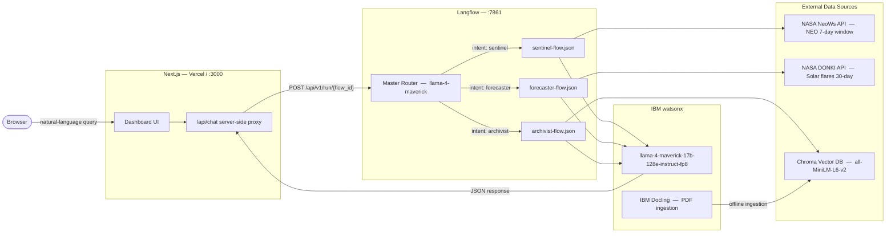

<p align="center">
  
</p>

# ORION — Orbital Research & Intelligence Orchestration Network

> **IBM AI Builders Challenge · August 2026 · Theme: Advance Space Exploration with AI**

---

## Selected Challenge Theme

**Advance Space Exploration with AI**

ORION directly addresses the challenge of making complex, fragmented space science data accessible and actionable through a conversational AI interface powered by IBM watsonx.

---

## Problem Statement

Space situational awareness today is a fragmented discipline. Near-Earth object tracking, solar weather forecasting, and deep astrophysics research each live in their own siloed data systems — NASA's NeoWs API, the DONKI space weather archive, and thousands of arXiv preprints — with no unified interface for a scientist, educator, or mission planner to query them all at once.

The problem is threefold:

1. **Data fragmentation.** Planetary defense data, heliophysics telemetry, and peer-reviewed research are scattered across incompatible APIs, PDFs, and web portals. Correlating them requires domain expertise and significant manual effort.
2. **Latency of insight.** Raw JSON from a NASA API is not actionable. A researcher needs synthesised, contextual summaries — not raw arrays of orbital parameters.
3. **Accessibility gap.** There is no tool that lets a developer, educator, or student ask *"Are any large asteroids approaching this week?"* or *"What does recent research say about solar flare prediction?"* and receive a coherent, cited answer in seconds.

ORION closes this gap with a single natural-language chat interface that routes each query to the right specialist agent and returns synthesised, data-backed responses in real time.

---

## Solution Description

ORION is a **Next.js Bento-box command center** — a mission-control-style dashboard where a single chat input dispatches queries to three purpose-built AI agents. Each agent owns a distinct data domain and renders its results in a dedicated panel below the chat bar.

### The Sentinel — Near-Earth Asteroid Tracker

The Sentinel agent queries the **NASA NeoWs (Near Earth Object Web Service)** API for asteroid close-approach data across a rolling 7-day window. Asteroid names, estimated diameters, miss distances, and potential-hazard classifications are extracted and passed to IBM watsonx Llama-4 Maverick for a concise situational briefing.

<p align="center">
  
  <br/>
  <em>The Sentinel panel: live asteroid approach data with AI-generated situational summary.</em>
</p>

---

### The Forecaster — Solar Weather Monitor

The Forecaster agent queries the **NASA DONKI (Database Of Notifications, Knowledge, Information)** API for solar flare events over the past 30 days. Flare classifications (A through X), peak times, and active region IDs are parsed into structured cards, then synthesised by watsonx into a space-weather advisory.

<p align="center">
  
  <br/>
  <em>The Forecaster panel: DONKI solar flare timeline with AI-generated activity summary.</em>
</p>

---

### The Archivist — Astrophysics Research Assistant

The Archivist is a full **Retrieval-Augmented Generation (RAG)** pipeline. A curated corpus of arXiv astrophysics PDFs — covering asteroid detection, solar flare forecasting, and exoplanetary research — was parsed offline using **IBM Docling**, chunked, embedded with `sentence-transformers/all-MiniLM-L6-v2`, and persisted to a local **Chroma** vector store. At query time, the top-5 relevant chunks are retrieved and passed to IBM watsonx Llama-4 Maverick for grounded, citation-backed answer synthesis.

<p align="center">
  
  <br/>
  <em>The Archivist panel: natural-language answers grounded in arXiv literature with source citations.</em>
</p>

---

## AI Approach & Architecture



### Multi-Agent Orchestration via Langflow

All agent coordination is handled by a **Langflow** pipeline composed of four exported flow definitions in `./langflow/flows/`:

| Flow File | Role |
|-----------|------|
| `orion-router.json` | Master Router — classifies intent, dispatches to sub-agent |
| `sentinel-flow.json` | Sentinel Agent — NeoWs fetch + Maverick summary |
| `forecaster-flow.json` | Forecaster Agent — DONKI fetch + Maverick summary |
| `archivist-flow.json` | Archivist Agent — Chroma retrieval + Maverick synthesis |

### IBM watsonx Model

| Model | Role |
|-------|------|
| `meta-llama/llama-4-maverick-17b-128e-instruct-fp8` | Intent routing, Sentinel/Forecaster narrative summaries, and Archivist RAG synthesis |

Llama-4 Maverick was selected across all agents for its instruction-following precision on structured JSON output. The selection was validated via a live benchmarking script (`scripts/test_model_candidates.py`) that tested all available watsonx models against the production routing prompt — Maverick returned the fastest response (1.1 s), cleanest JSON output, and correct intent classification across all test cases.

### IBM Docling — PDF Ingestion Pipeline

The `./scripts/ingest_pdfs.py` script uses **IBM Docling's `DocumentConverter`** to parse arXiv PDFs into structured markdown before chunking. Docling's layout-aware parsing correctly handles multi-column academic papers, figure captions, and mathematical notation — producing higher-quality text chunks than a naive PDF text extractor.

```
arXiv PDFs (./data/pdfs/)
  +-> IBM Docling DocumentConverter -> structured markdown
        +-> 512-token chunks with 64-token overlap
              +-> sentence-transformers/all-MiniLM-L6-v2 embeddings
                    +-> Chroma PersistentClient (./data/chroma_db/)
```

### Structured Response Contract

Every Langflow flow returns a consistent JSON envelope regardless of success or error:

```json
{
  "agent":   "sentinel | forecaster | archivist",
  "items":   [...],
  "summary": "...",
  "sources": ["..."],
  "error":   null
}
```

The Next.js frontend reads `agent` to determine which panel to activate, then renders `items` in a data table or card grid and `summary` / `sources` as the AI narrative block.

---

## Built with IBM Bob (Primary Development Tool)

ORION was built using **IBM Bob as the primary development tool** throughout all five phases of the project — functioning not as a passive code autocomplete, but as an active engineering collaborator that held full context across the entire codebase.

The architectural vision was established up front: three specialist agents, a Langflow orchestration layer, IBM watsonx as the LLM backbone, and a Next.js bento-box dashboard as the user interface. IBM Bob was then heavily utilised to translate that architecture into working, production-quality code at speed.

**Specific contributions where IBM Bob was the primary tool:**

- **Next.js Frontend Scaffolding.** The full dashboard layout, all five panel components (`SentinelPanel`, `ForecasterPanel`, `ArchivistPanel`, `TelemetryConsole`, `DetailPanel`), loading skeletons, idle state animations (radar sweep, waveform pulse, document scan), and the glassmorphic dark-space Tailwind theme were prototyped iteratively with Bob. The complete UI — including the telemetry console and slide-out detail drawer — was assembled in a single extended session.

- **Langflow Async Stream Debugging.** Resolving the async conflict between Langflow's LLM nodes and custom Python components required understanding both the Langflow 1.11 internal component lifecycle and the Next.js server-side fetch model. IBM Bob diagnosed the root cause, identified the correct `outputs[0].outputs[0].results.message.text` extraction path in the Langflow response envelope, and rebuilt the two-phase routing architecture with a JSON repair fallback.

- **Python API Integrations.** The custom Langflow Python components for the Sentinel (flattening the nested `near_earth_objects[date][]` NeoWs structure), the Forecaster (handling DONKI null responses for quiet solar periods), and the Archivist (Chroma top-k retrieval with metadata) were all written and debugged with Bob as the primary coding tool. The `ingest_pdfs.py` pipeline — Docling conversion, 512-token chunking with overlap, sentence-transformer embedding, and Chroma persistence — was written and validated end-to-end within the same session.

- **Model Benchmarking.** The `scripts/test_model_candidates.py` benchmarking script was written with Bob to systematically evaluate available IBM watsonx models against the production routing prompt before committing to a model choice.

- **Project Infrastructure.** The five-phase development plan (`orion-plan.md`), `.env.example` hygiene, `.gitignore` configuration, and `requirements.txt` consolidation were all managed collaboratively, with the plan updated at the close of each phase.

---

## Local Setup Instructions

### Prerequisites

| Requirement | Version |
|-------------|---------|
| Node.js | 18 or later |
| Python | 3.10 or later |
| ngrok | any (for Vercel demo only) |

---

### 1. Clone the repository

```bash
git clone <repo-url>
cd orion-space-command
```

### 2. Python environment and dependencies

```bash
# Windows (PowerShell)
.\.venv\Scripts\Activate.ps1

# macOS / Linux
source .venv/bin/activate

pip install -r requirements.txt
```

> `langflow` is a large package (~500 MB). Allow 5-10 minutes on first install.

### 3. Next.js frontend

```bash
cd frontend
npm install
```

### 4. Environment variables

```bash
cp .env.example frontend/.env.local
```

Edit `frontend/.env.local`:

```env
LANGFLOW_URL=http://localhost:7861

# Master router flow ID
LANGFLOW_FLOW_ID=<your-master-router-flow-id>

# Sub-agent flow IDs — each found in the Langflow UI URL bar for that flow
SENTINEL_FLOW_ID=<your-sentinel-flow-id>
FORECASTER_FLOW_ID=<your-forecaster-flow-id>
ARCHIVIST_FLOW_ID=<your-archivist-flow-id>

NASA_API_KEY=<your-nasa-api-key>

# Optional: only required if Langflow authentication is enabled
# LANGFLOW_API_KEY=
```

Export Langflow credentials in the same shell used to start Langflow:

```env
WATSONX_API_KEY=<your-ibm-cloud-api-key>
WATSONX_PROJECT_ID=<your-watsonx-project-id>
WATSONX_URL=https://us-south.ml.cloud.ibm.com
NASA_API_KEY=<your-nasa-api-key>
```

> Free NASA API key: https://api.nasa.gov
> IBM watsonx credentials: https://dataplatform.cloud.ibm.com

### 5. Ingest the Archivist corpus (one-time)

```bash
python scripts/ingest_pdfs.py
```

Parses `./data/pdfs/` via IBM Docling, embeds the chunks, and persists them to `./data/chroma_db/`.

### 6. Start Langflow

```bash
# Terminal 1
python -m langflow run
```

Open **http://localhost:7861**, import all four flow JSON files from `./langflow/flows/`, and configure watsonx credentials under Settings -> Global Variables. Then copy each flow's ID from the Langflow UI URL bar into `frontend/.env.local`:

```
LANGFLOW_FLOW_ID      <- Master Router flow
SENTINEL_FLOW_ID      <- Sentinel flow
FORECASTER_FLOW_ID    <- Forecaster flow
ARCHIVIST_FLOW_ID     <- Archivist flow
```

### 7. Start the Next.js dev server

```bash
# Terminal 2
cd frontend
npm run dev
```

The dashboard is available at **http://localhost:3000**.

---

### Vercel Deployment (live demo)

The Next.js frontend deploys to Vercel as-is. Langflow runs locally, so it must be
tunnelled to a public HTTPS URL before Vercel can reach it.

**Step 1 — Expose Langflow with ngrok**

```bash
# Terminal 3 (keep running for the duration of the demo)
ngrok http 7861
```

ngrok prints a public URL such as `https://abc123.ngrok-free.app`. Copy it.

**Step 2 — Set environment variables in Vercel**

In the Vercel dashboard for this project, go to **Settings -> Environment Variables**
and add the following (all environments: Production, Preview, Development):

| Variable | Value |
|----------|-------|
| `LANGFLOW_URL` | `https://abc123.ngrok-free.app` (your ngrok URL) |
| `LANGFLOW_FLOW_ID` | Master Router flow ID from Langflow UI |
| `SENTINEL_FLOW_ID` | Sentinel flow ID from Langflow UI |
| `FORECASTER_FLOW_ID` | Forecaster flow ID from Langflow UI |
| `ARCHIVIST_FLOW_ID` | Archivist flow ID from Langflow UI |
| `NASA_API_KEY` | Your NASA API key |
| `LANGFLOW_API_KEY` | Only if Langflow auth is enabled (optional) |

**Step 3 — Deploy**

```bash
# From the frontend/ directory, or connect the repo to Vercel via the dashboard
npx vercel --prod
```

Or push to `main` — Vercel auto-deploys on every push if the repo is connected.

> The ngrok URL changes every session unless a paid reserved domain is configured.
> Update `LANGFLOW_URL` in Vercel each time a new ngrok session is started.

**One-click deploy**

Connect the repository at **https://github.com/primegideon/orion-space-command**
to Vercel and set the **Root Directory** to `frontend`. All environment variables
above must be configured before the first deployment.

---

## Project Structure

```
orion-space-command/
+-- assets/
|   +-- orion-animated-logo.svg     # Project logo (SVG, animated)
|   +-- sentinel-ui.png             # Dashboard screenshot - Sentinel panel
|   +-- forecaster-ui.png           # Dashboard screenshot - Forecaster panel
|   +-- archivist-ui.png            # Dashboard screenshot - Archivist panel
+-- frontend/                       # Next.js 14 app (TypeScript + Tailwind CSS)
|   +-- src/app/
|   |   +-- page.tsx                # Main dashboard page
|   |   +-- api/chat/route.ts       # Langflow proxy API route
|   +-- src/components/
|   |   +-- SentinelPanel.tsx
|   |   +-- ForecasterPanel.tsx
|   |   +-- ArchivistPanel.tsx
|   |   +-- TelemetryConsole.tsx    # Live telemetry log console
|   |   +-- DetailPanel.tsx         # Slide-out item detail drawer
|   +-- .env.local                  # Local env vars (never committed)
+-- langflow/
|   +-- flows/
|   |   +-- orion-router.json
|   |   +-- sentinel-flow.json
|   |   +-- forecaster-flow.json
|   |   +-- archivist-flow.json
|   +-- components/                 # Custom Langflow Python components
+-- scripts/
|   +-- ingest_pdfs.py              # One-time Docling to Chroma ingestion
|   +-- test_nasa_apis.py           # NASA API connectivity smoke test
|   +-- test_watsonx.py             # watsonx LLM connectivity smoke test
|   +-- test_model_candidates.py    # watsonx model benchmarking
+-- data/
|   +-- pdfs/                       # arXiv source PDFs
|   +-- chroma_db/                  # Persisted Chroma vector store
|   +-- README.md                   # PDF sources and arXiv IDs
+-- frontend/
|   +-- vercel.json                 # Vercel deployment configuration
+-- requirements.txt                # Python dependencies
+-- .env.example                    # Environment variable template (safe to commit)
+-- LICENSE                         # MIT License
+-- orion-plan.md                   # Full phased development plan
```

---

## Secrets Hygiene

- `frontend/.env.local` — gitignored by default.
- Root `.env` — gitignored.
- **Never commit** `NASA_API_KEY`, `WATSONX_API_KEY`, or `WATSONX_PROJECT_ID`.
- `.env.example` contains only placeholder values and is safe to commit.

---

## License

This project is licensed under the **MIT License** — see the [LICENSE](./LICENSE) file for details.
