<p align="center">
  
</p>

# ORION — Orbital Research & Intelligence Orchestration Network

> **IBM AI Builders Challenge · August 2026 · Theme: Advance Space Exploration with AI**

[](https://orion-space-command.vercel.app)
[](https://nextjs.org)
[](https://www.ibm.com/watsonx)
[](https://supabase.com)
[](https://threejs.org)
[](https://orion-space-command.vercel.app)

**Live:** https://orion-space-command.vercel.app

---

## Selected Challenge Theme

**Advance Space Exploration with AI**

ORION directly addresses the challenge of making complex, fragmented space science data accessible and actionable through a conversational AI interface powered by IBM watsonx.

---

## Problem Statement

Space situational awareness today is a fragmented discipline. Near-Earth object tracking, solar weather forecasting, and deep astrophysics research each live in their own siloed data systems — NASA's NeoWs API, the DONKI space weather archive, and thousands of arXiv preprints — with no unified interface for a scientist, educator, or mission planner to query them all at once.

The problem is threefold:

1. **Data fragmentation.** Planetary defense data, heliophysics telemetry, and peer-reviewed research are scattered across incompatible APIs, PDFs, and web portals. Correlating them requires domain expertise and significant manual effort.
2. **Latency of insight.** Raw JSON from a NASA API is not actionable. A researcher needs synthesised, contextual summaries — not raw arrays of orbital parameters.
3. **Accessibility gap.** There is no tool that lets a developer, educator, or student ask *"Are any large asteroids approaching this week?"* or *"What does recent research say about solar flare prediction?"* and receive a coherent, cited answer in seconds.

ORION closes this gap with a single natural-language chat interface that routes each query to the right specialist agent and returns synthesised, data-backed responses in real time.

---

## Solution Description

ORION is a **Next.js Bento-box command center** — a mission-control-style dashboard where a single chat input dispatches queries to three purpose-built AI agents. Each agent owns a distinct data domain and renders its results in a dedicated panel below the chat bar.

### The Sentinel — Near-Earth Asteroid Tracker

The Sentinel agent queries the **NASA NeoWs (Near Earth Object Web Service)** API for asteroid close-approach data across a rolling 7-day window. Asteroid names, estimated diameters, miss distances, and potential-hazard classifications are extracted and passed to IBM watsonx Llama-4 Maverick for a concise situational briefing.

<p align="center">
  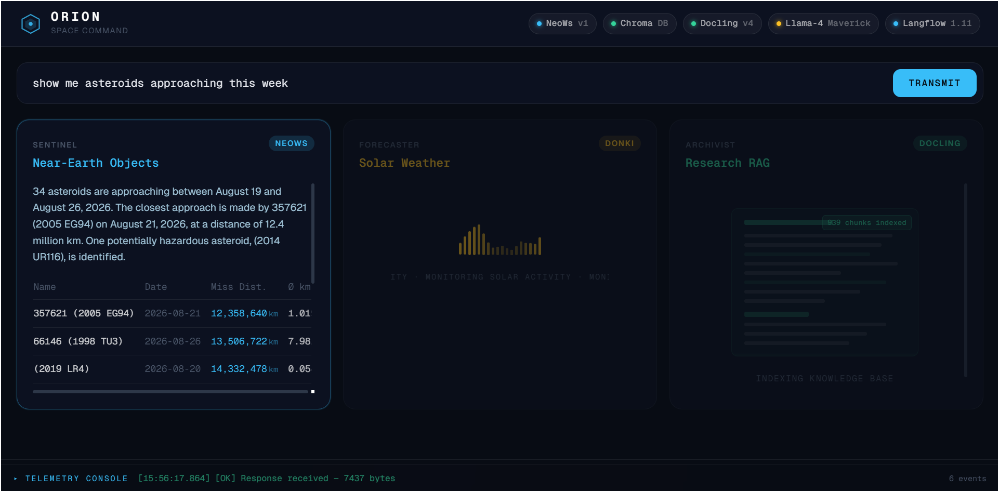
  <br/>
  <em>The Sentinel panel: live asteroid approach data with AI-generated situational summary.</em>
</p>

---

### The Forecaster — Solar Weather Monitor

The Forecaster agent queries the **NASA DONKI (Database Of Notifications, Knowledge, Information)** API for solar flare events over the past 30 days. Flare classifications (A through X), peak times, and active region IDs are parsed into structured cards, then synthesised by watsonx into a space-weather advisory.

<p align="center">
  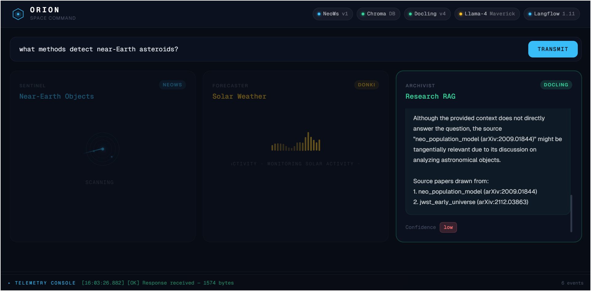
  <br/>
  <em>The Forecaster panel: DONKI solar flare timeline with AI-generated activity summary.</em>
</p>

---

### The Archivist — Astrophysics Research Assistant

The Archivist is a full **Retrieval-Augmented Generation (RAG)** pipeline. A curated corpus of arXiv astrophysics PDFs — covering asteroid detection, solar flare forecasting, and exoplanetary research — was parsed offline using **IBM Docling**, chunked, embedded with `sentence-transformers/all-MiniLM-L6-v2`, and persisted to a **Supabase pgvector** cloud database (939 chunks, HNSW cosine similarity index). At query time, the top-5 relevant chunks are retrieved and passed to IBM watsonx Llama-4 Maverick for grounded, citation-backed answer synthesis.

<p align="center">
  
  <br/>
  <em>The Archivist panel: natural-language answers grounded in arXiv literature with source citations.</em>
</p>

---

## AI Approach & Architecture

### V1 → V2: Architectural Evolution

ORION shipped in two phases. **V1** validated the multi-agent concept using a locally-hosted Langflow pipeline as the orchestration layer, with a local Chroma vector store for the Archivist RAG. **V2** migrated to a fully serverless, cloud-native architecture with no local processes required.

| Component | V1 (Prototype) | V2 (Production) |
|-----------|---------------|-----------------|
| Agent orchestration | Langflow local server (`:7861`) | Next.js serverless API routes |
| LLM calls | Langflow watsonx node | Direct IBM watsonx REST (IAM token cached) |
| Vector store | Local Chroma DB | Supabase PostgreSQL + pgvector |
| Public access | ngrok tunnel | Vercel global edge network |
| Deploy | Manual ngrok restart + push | `git push origin main` |

### V2 Production Architecture

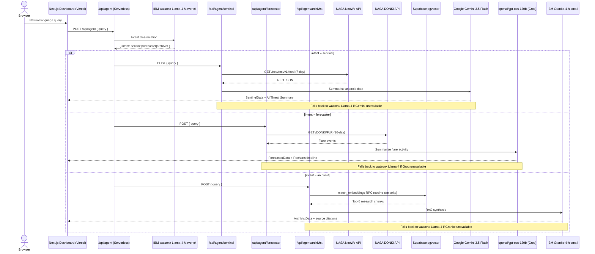

### V1 Langflow Flows (archived)

The V1 Langflow flows are preserved in `./langflow/flows/` for reference:

| Flow File | Role |
|-----------|------|
| `orion-router.json` | Master Router — classifies intent, dispatches to sub-agent |
| `sentinel-flow.json` | Sentinel Agent — NeoWs fetch + Maverick summary |
| `forecaster-flow.json` | Forecaster Agent — DONKI fetch + Maverick summary |
| `archivist-flow.json` | Archivist Agent — Chroma retrieval + Maverick synthesis |

### Multi-Model AI Fleet

ORION V2 distributes AI workloads across **four specialist model providers** — each agent uses the model best suited to its task, with automatic fallback to watsonx Llama-4 Maverick if a provider is unreachable.

| Agent | Primary Model | Provider | Fallback |
|-------|--------------|----------|---------|
| **Router** | `llama-4-maverick-17b-128e-instruct-fp8` | IBM watsonx | — |
| **Sentinel** | `gemini-3.5-flash` | Google AI Studio | watsonx Llama-4 |
| **Forecaster** | `openai/gpt-oss-120b` | Groq | watsonx Llama-4 |
| **Archivist RAG** | `ibm/granite-4-h-small` | IBM watsonx | watsonx Llama-4 |

- **Granite-4-h-small** was selected for Archivist RAG synthesis after live benchmarking against all available watsonx models — it is the only Granite instruct model active on this account's plan and produces clean, citation-aware prose from retrieved research chunks.
- **Gemini 3.5 Flash** handles Sentinel summaries for its speed on structured JSON narration.
- **openai/gpt-oss-120b via Groq** handles Forecaster solar weather narratives. This is a reasoning model — it uses internal chain-of-thought before producing output, so the route allocates a 1024-token budget and reads from both `content` and `reasoning` fields in the response.
- All model calls use plain `fetch()` — no SDK packages required. Rate-limit errors (HTTP 429) are caught and surfaced as friendly messages rather than raw API errors.

### IBM Docling — PDF Ingestion Pipeline

The `./scripts/ingest_pdfs.py` script uses **IBM Docling's `DocumentConverter`** to parse arXiv PDFs into structured markdown before chunking. Docling's layout-aware parsing correctly handles multi-column academic papers, figure captions, and mathematical notation — producing higher-quality text chunks than a naive PDF text extractor.

```
arXiv PDFs (./data/pdfs/)
  +-> IBM Docling DocumentConverter -> structured markdown
        +-> 512-token chunks with 64-token overlap
              +-> sentence-transformers/all-MiniLM-L6-v2 embeddings
                    +-> Chroma PersistentClient (./data/chroma_db/)   [V1 local]
                    +-> Supabase pgvector via migrate_to_supabase.py  [V2 cloud]
```

### Structured Response Contract

Every V2 sub-agent route handler returns a consistent JSON envelope regardless of success or error:

```json
{
  "agent":   "sentinel | forecaster | archivist",
  "items":   [...],
  "summary": "...",
  "sources": ["..."],
  "error":   null
}
```

The Next.js frontend reads `agent` to determine which panel to activate, then renders `items` in a data table or card grid and `summary` / `sources` as the AI narrative block.

---

## Built with IBM Bob (Primary Development Tool)

ORION was built using **IBM Bob as the primary development tool** throughout all phases of the project — V1 prototyping through V2 cloud-native migration — functioning not as a passive code autocomplete, but as an active engineering collaborator that held full context across the entire codebase.

The architectural vision was established up front: three specialist agents, IBM watsonx as the LLM backbone, and a Next.js bento-box dashboard as the user interface. IBM Bob was then heavily utilised to translate that architecture into working, production-quality code at speed — and to drive the full V2 serverless migration.

**Specific contributions where IBM Bob was the primary tool:**

- **Next.js Frontend Scaffolding.** The full dashboard layout, all 17 components (`SentinelPanel`, `ForecasterPanel`, `ArchivistPanel`, `AnalyticsView`, `AdvancedThreatMatrix`, `ConstellationFleet`, `MissionActivityLog`, `GroundRelayGrid`, `KpStatusBanner`, `MitigationBanner`, `RiskMatrix`, `OrbitalCanvas`, `FlareChart`, `DetailPanel`, `Sidebar`, `SystemStatusModal`, `TelemetryConsole`), loading skeletons, idle state animations (radar sweep, waveform pulse, document scan), and the glassmorphic dark-space Tailwind theme were prototyped iteratively with Bob. The complete UI — including the telemetry console, slide-out detail drawer, navigation rail, and six distinct views — was assembled across extended sessions.

- **Langflow Async Stream Debugging (V1).** Resolving the async conflict between Langflow's LLM nodes and custom Python components required understanding both the Langflow 1.11 internal component lifecycle and the Next.js server-side fetch model. IBM Bob diagnosed the root cause, identified the correct `outputs[0].outputs[0].results.message.text` extraction path in the Langflow response envelope, and rebuilt the two-phase routing architecture with a JSON repair fallback.

- **Python API Integrations.** The custom Langflow Python components for the Sentinel (flattening the nested `near_earth_objects[date][]` NeoWs structure), the Forecaster (handling DONKI null responses for quiet solar periods), and the Archivist (Chroma top-k retrieval with metadata) were all written and debugged with Bob. The `ingest_pdfs.py` pipeline — Docling conversion, 512-token chunking with overlap, sentence-transformer embedding, and Chroma persistence — was written and validated end-to-end within the same session.

- **V2 Serverless Migration.** IBM Bob drove the complete architectural migration from Langflow to Next.js serverless route handlers with direct IBM watsonx REST integration, including IAM token caching, intent routing prompt engineering, robust JSON extraction with multi-fallback parsing, and output sanitisation to strip chain-of-thought artifacts.

- **Supabase pgvector Pipeline.** The full cloud RAG migration — PostgreSQL schema design, HNSW index configuration, `match_embeddings` cosine similarity RPC, and the `migrate_to_supabase.py` script that transferred 939 embedded chunks from local Chroma to Supabase — was designed and implemented with Bob.

- **3D Orbital Canvas & Solar Charts.** The Three.js / React Three Fiber interactive asteroid trajectory visualisation (`OrbitalCanvas.tsx`) and the Recharts solar flare time-series charts (`FlareChart.tsx`) were built with Bob, including the miss-distance-to-scene-unit mapping, Bezier trajectory arcs, and severity-colour-coded scatter plots.

- **Model Benchmarking.** The `scripts/test_model_candidates.py` benchmarking script was written with Bob to systematically evaluate available IBM watsonx models against the production routing prompt before committing to a model choice.

- **Project Infrastructure.** The phased development plans (`orion-plan.md`, `orion-v2-plan.md`), `.env.example` hygiene, `.gitignore` configuration, Vercel deployment troubleshooting, and environment variable management were all handled collaboratively with Bob.

---

## Setup & Deployment

### Prerequisites

| Requirement | Version |
|-------------|---------|
| Node.js | 22.x |
| Python | 3.10 or later (scripts only) |

---

### 1. Clone the repository

```bash
git clone https://github.com/primegideon/orion-space-command.git
cd orion-space-command
```

### 2. Install frontend dependencies

```bash
cd frontend
npm install
```

### 3. Configure environment variables

```bash
cp .env.example frontend/.env.local
```

Edit `frontend/.env.local` with your credentials:

```env
# IBM watsonx.ai — https://dataplatform.cloud.ibm.com
WATSONX_API_KEY=your_ibm_cloud_api_key
WATSONX_PROJECT_ID=your_watsonx_project_id
WATSONX_URL=https://us-south.ml.cloud.ibm.com

# NASA Open APIs — https://api.nasa.gov (free)
NASA_API_KEY=your_nasa_api_key

# Supabase pgvector — https://supabase.com
NEXT_PUBLIC_SUPABASE_URL=https://your-project.supabase.co
SUPABASE_SERVICE_ROLE_KEY=your_supabase_service_role_key

# Google AI Studio (Gemini 3.5 Flash) — https://aistudio.google.com/app/apikey
# Used by Sentinel for NL summaries — falls back to watsonx if absent
GEMINI_API_KEY=your_google_ai_studio_api_key

# Groq (openai/gpt-oss-120b) — https://console.groq.com/keys
# Used by Forecaster for NL summaries — falls back to watsonx if absent
GROQ_API_KEY=your_groq_api_key
```

> **Note:** `.env.example` contains the complete list of required variables. `GEMINI_API_KEY` and `GROQ_API_KEY` are optional — if absent, those agents fall back to watsonx Llama-4 automatically. There are no Langflow or ngrok variables in V2 — those were V1 only.

### 4. Set up Supabase (one-time)

1. Create a project at **https://supabase.com**
2. In **SQL Editor**, paste and run [`scripts/supabase_schema.sql`](./scripts/supabase_schema.sql)
3. Run the migration to populate the vector store:

```powershell
# Windows PowerShell — activate venv first
.\.venv\Scripts\Activate.ps1
$env:SUPABASE_URL = "https://your-project.supabase.co"
$env:SUPABASE_SERVICE_ROLE_KEY = "your-service-role-key"
python scripts/migrate_to_supabase.py
```

### 5. Start the development server

```bash
cd frontend
npm run dev
```

Dashboard available at **http://localhost:3000**.

---

### Vercel Deployment

1. Connect the repository at **https://vercel.com/new** → Import `primegideon/orion-space-command`
2. Set **Root Directory** to `frontend`
3. Set **Node.js Version** to `22.x`
4. Add all environment variables under **Settings → Environments**:

| Variable | Required | Description |
|----------|----------|-------------|
| `WATSONX_API_KEY` | ✅ | IBM Cloud API key |
| `WATSONX_PROJECT_ID` | ✅ | watsonx.ai project ID |
| `WATSONX_URL` | ✅ | `https://us-south.ml.cloud.ibm.com` |
| `NASA_API_KEY` | ✅ | NASA Open APIs key (free at api.nasa.gov) |
| `NEXT_PUBLIC_SUPABASE_URL` | ✅ | Supabase project URL |
| `SUPABASE_SERVICE_ROLE_KEY` | ✅ | Supabase service role key |
| `GEMINI_API_KEY` | ⚡ optional | Google AI Studio key — Sentinel uses Gemini 3.5 Flash; falls back to watsonx if absent |
| `GROQ_API_KEY` | ⚡ optional | Groq API key — Forecaster uses `openai/gpt-oss-120b`; falls back to watsonx if absent |

5. Push to `main` — Vercel auto-deploys on every commit. No ngrok, no local processes required.

---

## Live Data Feeds

Every secondary dashboard panel is driven by a real external data source — no mocked or static data anywhere in the system.

| Panel | Route | Source | Cadence |
|-------|-------|--------|---------|
| Orbital Debris & Drag | `/api/satellites` + `/api/kp` | CelesTrak satcat + NOAA Kp index | 10 min |
| Solar Wind | `/api/solarwind` | NOAA SWPC DSCOVR RTSW mag + plasma | 60 s |
| RF / Spectrum Risk | derived from Kp + flare data | NOAA Kp + NASA DONKI | live |
| Ground Relay Map | `/api/dsn` + `/api/satnogs` | NASA DSN XML feed + SatNOGS Network API | 15 s / 5 min |
| Constellation Fleet | `/api/satellites` + `/api/tle` | CelesTrak satcat + TLE SGP4 propagation | 10 min / 10 min |
| Orbit Viewer | `/api/horizons` | NASA JPL Horizons ephemeris | per-request |
| Sentinel NEOs | `/api/agent/sentinel` → NASA NeoWs | NASA NeoWs 7-day feed | on query |
| Forecaster Flares | `/api/agent/forecaster` → NASA DONKI | NASA DONKI 30-day FLR feed | on query |

**SatNOGS streaming strategy:** The SatNOGS API returns a ~2.8 MB plain array of all stations. Rather than downloading the full payload, the `/api/satnogs` route streams the response, parses station objects as chunks arrive, and cancels the connection once 300 online candidates are collected. These are then spread across 5 longitude bands (7 per band) to ensure a globally distributed map — avoiding the European cluster that results from taking the first N by station ID.

---

## Project Structure

```
orion-space-command/
+-- assets/                              # Screenshots and project logo
|   +-- orion-animated-logo.svg          # Project logo (SVG, animated)
+-- frontend/                            # Next.js 14 app (TypeScript + Tailwind CSS)
|   +-- src/app/
|   |   +-- page.tsx                     # Main dashboard page + view router
|   |   +-- layout.tsx                   # Root layout + global fonts
|   |   +-- globals.css                  # Tailwind base + CSS custom properties
|   |   +-- api/agent/
|   |   |   +-- route.ts                 # Master intent router (keyword + watsonx)
|   |   |   +-- sentinel/route.ts        # NeoWs fetch + watsonx summary
|   |   |   +-- forecaster/route.ts      # DONKI fetch + watsonx summary
|   |   |   +-- archivist/route.ts       # Supabase pgvector RAG
|   |   +-- api/analytics/route.ts       # 30-day flare/CME/NEO analytics aggregator
|   |   +-- api/donki/route.ts           # Live NOAA DONKI flare + R-Scale feed
|   |   +-- api/dsn/route.ts             # NASA Deep Space Network XML parser
|   |   +-- api/kp/route.ts              # NOAA SWPC planetary Kp-index feed
|   |   +-- api/logs/route.ts            # Supabase system_logs reader
|   |   +-- api/satellites/route.ts      # CelesTrak satcat orbital parameters
|   +-- src/components/
|   |   +-- SentinelPanel.tsx            # Asteroid table + AI threat summary
|   |   +-- ForecasterPanel.tsx          # Flare cards + Recharts charts
|   |   +-- ArchivistPanel.tsx           # RAG answer + source citations
|   |   +-- AnalyticsView.tsx            # 30-day historical charts + protocol cards
|   |   +-- AdvancedThreatMatrix.tsx     # Orbital debris, spectrum & compliance modules
|   |   +-- ConstellationFleet.tsx       # Live CelesTrak satellite fleet table
|   |   +-- MissionActivityLog.tsx       # Supabase query audit log + routing stats
|   |   +-- GroundRelayGrid.tsx          # NASA DSN world map + station table
|   |   +-- KpStatusBanner.tsx           # Live NOAA Kp status banner
|   |   +-- MitigationBanner.tsx         # Auto-triggered flare/PHO alert banner
|   |   +-- RiskMatrix.tsx               # Flare-driven sat-comms/power/radiation bars
|   |   +-- OrbitalCanvas.tsx            # Three.js / R3F asteroid trajectory scene
|   |   +-- FlareChart.tsx               # Recharts solar weather time-series charts
|   |   +-- DetailPanel.tsx              # Slide-out asteroid / flare detail drawer
|   |   +-- Sidebar.tsx                  # Navigation rail + utility buttons
|   |   +-- SystemStatusModal.tsx        # API dependency health modal
|   |   +-- TelemetryConsole.tsx         # Live session telemetry log console
|   +-- src/lib/
|   |   +-- watsonx.ts                   # IAM token cache + generateText + generateEmbedding
|   |   +-- groq.ts                      # Groq REST helper — openai/gpt-oss-120b (Forecaster primary)
|   |   +-- gemini.ts                    # Google Gemini REST helper — gemini-3.5-flash (Sentinel primary)
|   |   +-- github-models.ts             # GitHub Models REST helper — gpt-4o (utility)
|   |   +-- supabase.ts                  # Supabase admin client (service-role)
|   |   +-- exportPdf.ts                 # Client-side PDF mission briefing generator
+-- langflow/                            # V1 flows (archived for reference)
|   +-- flows/
|   +-- components/                      # V1 custom Python components
+-- scripts/
|   +-- supabase_schema.sql              # pgvector schema + match_embeddings RPC
|   +-- migrate_to_supabase.py           # One-time Chroma → Supabase migration
|   +-- ingest_pdfs.py                   # One-time Docling → Chroma ingestion (V1)
|   +-- download_pdfs.py                 # arXiv PDF bulk downloader
|   +-- test_model_candidates.py         # watsonx model benchmarking
|   +-- test_watsonx.py                  # watsonx connectivity test
|   +-- test_nasa_apis.py                # NASA API connectivity test
|   +-- test_langflow.py                 # V1 Langflow integration test
|   +-- _gen_flows.py                    # V1 flow scaffolding helper
|   +-- _verify_chroma.py                # V1 Chroma vector store verifier
|   +-- _verify_flows.py                 # V1 Langflow flow verifier
+-- data/
|   +-- pdfs/                            # arXiv source PDFs
|   +-- chroma_db/                       # Local Chroma vector store (V1)
|   +-- README.md                        # PDF sources and arXiv IDs
+-- requirements.txt                     # Python dependencies
+-- .env.example                         # Environment variable template
+-- LICENSE                              # MIT License
+-- orion-plan.md                        # V1 phased development plan
+-- orion-v2-plan.md                     # V2 cloud-native engineering roadmap
```

---

## 📖 How to Use & Read This System

ORION is designed as a multi-view aerospace command terminal. Here is how to navigate the interface:

**The Global Header**
The top bar is your persistent mission status. It tracks the active ground relay uplink (pulsing green dot), global threat status badge, live UTC clock and Mission Elapsed Time (MET), and your operator clearance level.

**Voice & Text Command**
Use the main input bar to query the system. Click the microphone icon to dictate natural language queries (e.g., *"Show me approaching asteroids"*), then click **Transmit** to route the query through the watsonx intent classifier. The system automatically selects the correct specialist agent — no manual routing required.

**Navigation Rail (Left Sidebar)**
Click the `‹` chevron to expand or collapse the sidebar at any time.

| View | Icon | Description |
|------|------|-------------|
| **Telemetry Core** | Signal waves | The primary live-fire dashboard featuring the Sentinel (NEO tracking), Forecaster (solar weather + risk model), and Archivist (RAG research database). |
| **Threat & Risk** | Star shield | Toggles between 30-day historical data charts and a live heuristic analysis of orbital debris drag, cybersecurity/spectrum integrity, and international data compliance. |
| **Constellation** | Globe/orbit | A fleet overview monitoring orbital bands, Altitude (km), Inclination (degrees), Orbital Period (minutes), and Orbital Band (LEO/MEO/GEO) of all tracked satellites. |
| **Mission Log** | Document | An audit trail of recent LLM queries showing agent routing decisions, end-to-end latency, live Routing Success Rate, and the live telemetry log from the current session. |
| **Ground Relay** | Antenna | An equirectangular world map and status table showing real-time uplink/downlink status, data rates, elevation angles, and next contact windows for global Deep Space Network (DSN) nodes. |
| **Orbit Viewer** | Orbit rings | A dual-purpose situational awareness hub featuring an interactive NASA Eyes 3D macro-visualization and a secure routing bridge to the JPL Small-Body Database for micro-level threat verification. |

**Utilities (Bottom of Sidebar)**

| Button | Description |
|--------|-------------|
| **System Status** | Opens a modal that simulates latency probes against all six API dependencies (NASA NeoWs, DONKI, Supabase, IBM watsonx, IAM, Docling) and reports heuristic latency and uptime. |
| **Export PDF** | Generates a client-side PDF mission briefing including mission timestamp, active threat status, satellite insurance risk assessment, and the full telemetry log from the current session. When clicked, the Data Compliance Gateway in the Threat Matrix view animates through its regulatory verification sequence. |

**Mitigation Banner**
When a live query returns an X-class or M5+ solar flare, or a PHO asteroid approach, a colour-coded alert banner automatically appears above the dashboard grid. Severity levels are `WATCH → ELEVATED → SEVERE → CRITICAL`, and when both a flare and asteroid trigger simultaneously the level is automatically escalated. The banner is dismissible and re-appears on each new query.

---

## 🖼️ System Gallery

### Telemetry Core — Live Agent Dashboard
<p align="center">
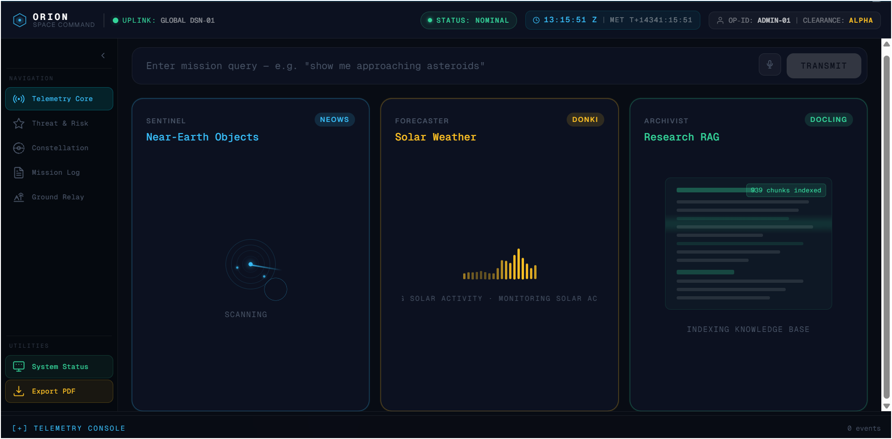
<br/>
<em>The primary command view: Sentinel asteroid tracker, Forecaster solar weather, and Archivist RAG panel side-by-side.</em>
</p>

### Historical Analytics — 30-Day Flare Frequency
<p align="center">
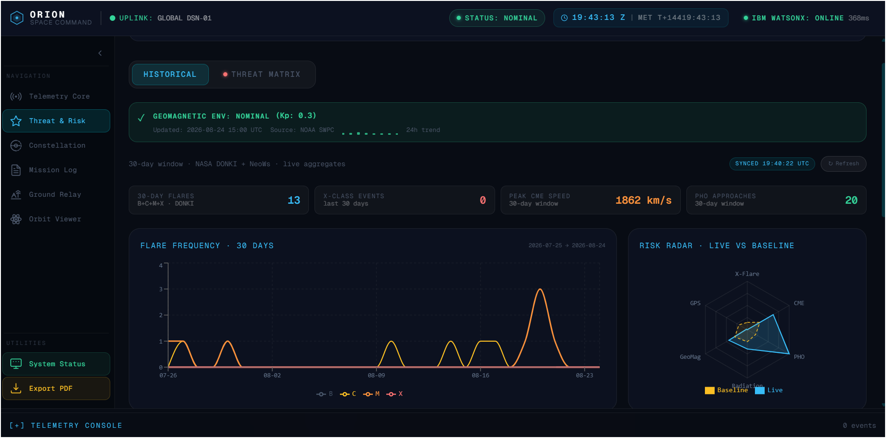
<br/>
<em>30-day flare frequency line chart and multi-axis live risk radar comparing current telemetry against historical baselines.</em>
</p>

### Threat Posture — CME & Mitigation Protocols
<p align="center">
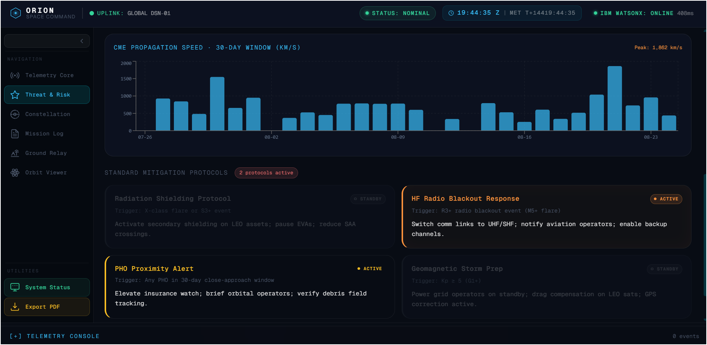
<br/>
<em>30-day CME propagation speed bar chart and automated rule-based hardware mitigation protocol triggers.</em>
</p>

### Advanced Threat Matrix
<p align="center">
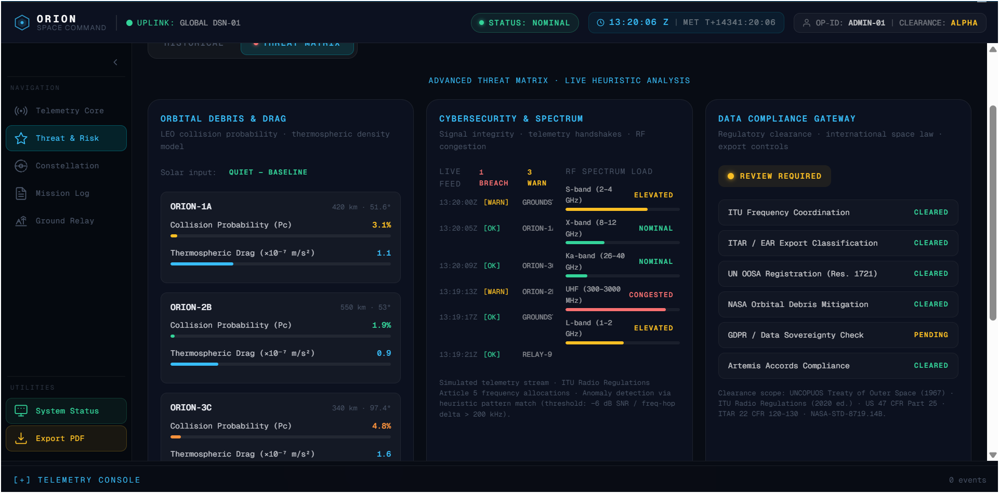
<br/>
<em>Three-module heuristic analysis: Orbital Debris & Drag (driven by live CelesTrak + Kp data), Cybersecurity & Spectrum monitor, and Data Compliance Gateway.</em>
</p>

### Constellation Fleet
<p align="center">
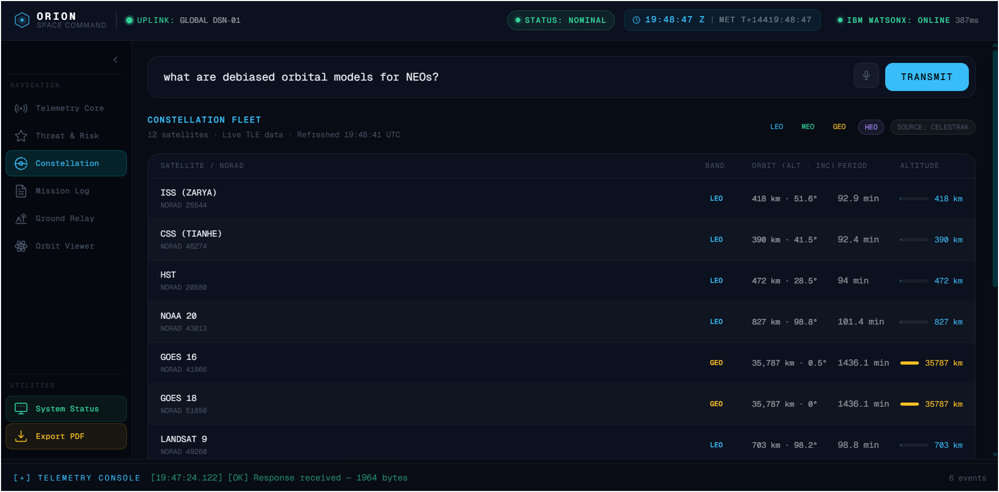
<br/>
<em>Full fleet telemetry table across LEO/MEO/GEO/HEO orbital bands with Altitude (km), Inclination (degrees), Orbital Period (minutes), and Orbital Band (LEO/MEO/GEO) per satellite — sourced live from CelesTrak.</em>
</p>

### Mission Activity Log
<p align="center">
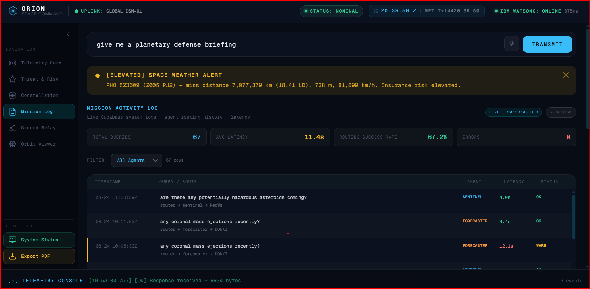
<br/>
<em>Audit trail of recent watsonx queries with agent routing history, latency metrics, live Routing Success Rate, and live current-session console output.</em>
</p>

### Ground Relay Grid — World Map
<p align="center">
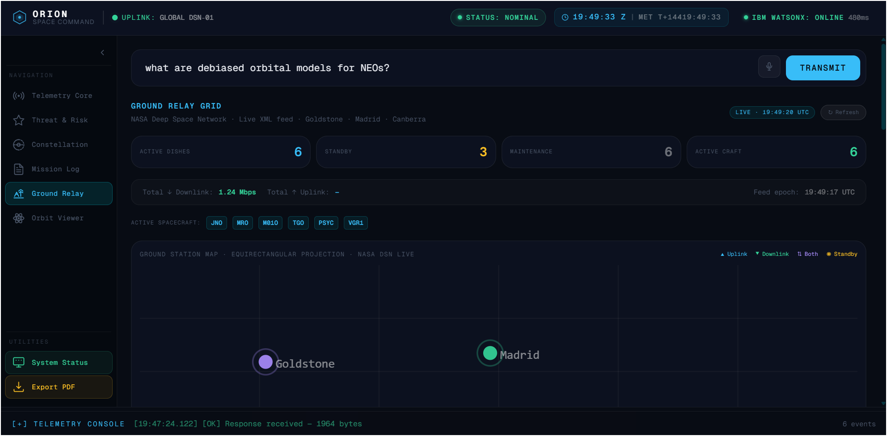
<br/>
<em>Equirectangular projection of global ground station coverage. Pulsing rings indicate active uplink/downlink nodes.</em>
</p>

### Ground Relay Grid — Station Table
<p align="center">
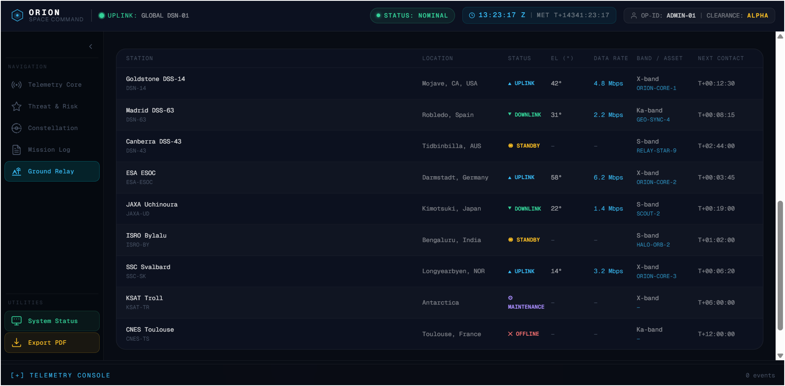
<br/>
<em>DSN/ESA/JAXA/ISRO/SSC/KSAT station status table with live data rates, elevation angles, frequency bands, and next contact windows.</em>
</p>

### Orbit Viewer — Situational Awareness
<p align="center">
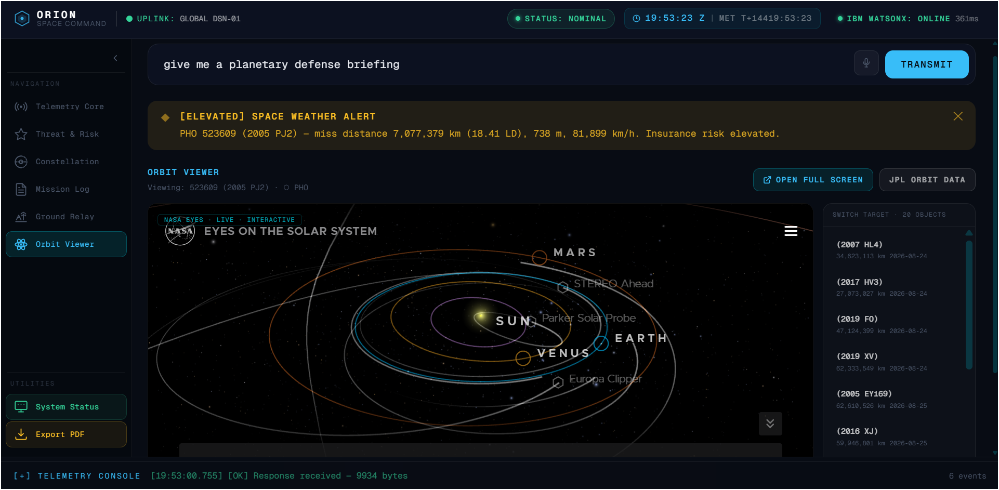
<br/>
<em>Standalone 3D solar system macro-visualization paired with a secure data bridge to the JPL Small-Body Database for threat verification.</em>
</p>

---

## 🧪 Sample Mission Queries

### 🛰️ Sentinel — Near-Earth Objects
- `show me asteroids approaching this week`
- `are there any potentially hazardous asteroids coming?`
- `what near-Earth objects are closest to Earth right now?`
- `show me all PHO asteroids in the next 7 days`
- `which asteroid has the smallest miss distance this week?`
- `give me a planetary defense briefing`
- `what's the largest asteroid approaching Earth soon?`
- `are any asteroids bigger than 1km coming close?`
- `show me the fastest moving asteroid this week`
- `NEO close approach data`

### ☀️ Forecaster — Solar Weather
- `solar flare activity last 30 days`
- `have there been any X-class flares recently?`
- `what's the current space weather situation?`
- `show me solar weather activity`
- `any M-class or X-class flares this month?`
- `what's the risk to satellites from solar activity?`
- `give me a solar weather briefing`
- `how active has the sun been lately?`
- `show me DONKI flare data`
- `any coronal mass ejections recently?`
- `what solar events could affect communications?`
- `is there elevated radiation risk from solar activity?`

### 📚 Archivist — Astrophysics Research RAG
- `what does research say about asteroid deflection?`
- `how do scientists predict solar flares?`
- `explain near-Earth object detection methods`
- `what are kinetic impactor deflection strategies?`
- `how does machine learning help with solar flare forecasting?`
- `what is the Torino scale?`
- `explain the role of active regions in solar flare prediction`
- `what research exists on solar energetic particle events?`
- `how does JWST contribute to astrophysics research?`
- `what are debiased orbital models for NEOs?`
- `explain CNN models for space weather prediction`
- `what mitigation strategies exist for asteroid impacts?`
- `how do HMI magnetograms help forecast flares?`
- `what is the current state of near-Earth asteroid survey completeness?`
- `explain the relationship between solar flares and SEP events`
- `what does research say about planetary defense readiness?`

---

## Secrets Hygiene

- `frontend/.env.local` — gitignored by default.
- Root `.env` — gitignored.
- **Never commit** `NASA_API_KEY`, `WATSONX_API_KEY`, or `WATSONX_PROJECT_ID`.
- `.env.example` contains only placeholder values and is safe to commit.

---

## License

This project is licensed under the **MIT License** — see the [LICENSE](./LICENSE) file for details.
