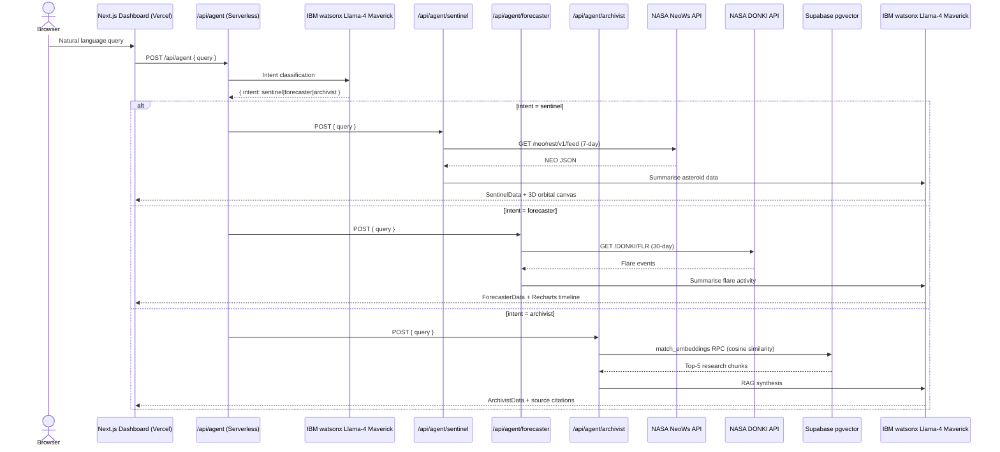

<p align="center">
  
</p>

# ORION — Orbital Research & Intelligence Orchestration Network

> **IBM AI Builders Challenge · August 2026 · Theme: Advance Space Exploration with AI**

[](https://orion-space-command.vercel.app)
[](https://nextjs.org)
[](https://www.ibm.com/watsonx)
[](https://supabase.com)
[](https://threejs.org)
[](https://orion-space-command.vercel.app)

**Live:** https://orion-space-command.vercel.app

---

## Selected Challenge Theme

**Advance Space Exploration with AI**

ORION directly addresses the challenge of making complex, fragmented space science data accessible and actionable through a conversational AI interface powered by IBM watsonx.

---

## Problem Statement

Space situational awareness today is a fragmented discipline. Near-Earth object tracking, solar weather forecasting, and deep astrophysics research each live in their own siloed data systems — NASA's NeoWs API, the DONKI space weather archive, and thousands of arXiv preprints — with no unified interface for a scientist, educator, or mission planner to query them all at once.

The problem is threefold:

1. **Data fragmentation.** Planetary defense data, heliophysics telemetry, and peer-reviewed research are scattered across incompatible APIs, PDFs, and web portals. Correlating them requires domain expertise and significant manual effort.
2. **Latency of insight.** Raw JSON from a NASA API is not actionable. A researcher needs synthesised, contextual summaries — not raw arrays of orbital parameters.
3. **Accessibility gap.** There is no tool that lets a developer, educator, or student ask *"Are any large asteroids approaching this week?"* or *"What does recent research say about solar flare prediction?"* and receive a coherent, cited answer in seconds.

ORION closes this gap with a single natural-language chat interface that routes each query to the right specialist agent and returns synthesised, data-backed responses in real time.

---

## Solution Description

ORION is a **Next.js Bento-box command center** — a mission-control-style dashboard where a single chat input dispatches queries to three purpose-built AI agents. Each agent owns a distinct data domain and renders its results in a dedicated panel below the chat bar.

### The Sentinel — Near-Earth Asteroid Tracker

The Sentinel agent queries the **NASA NeoWs (Near Earth Object Web Service)** API for asteroid close-approach data across a rolling 7-day window. Asteroid names, estimated diameters, miss distances, and potential-hazard classifications are extracted and passed to IBM watsonx Llama-4 Maverick for a concise situational briefing.

<p align="center">
  
  <br/>
  <em>The Sentinel panel: live asteroid approach data with AI-generated situational summary.</em>
</p>

---

### The Forecaster — Solar Weather Monitor

The Forecaster agent queries the **NASA DONKI (Database Of Notifications, Knowledge, Information)** API for solar flare events over the past 30 days. Flare classifications (A through X), peak times, and active region IDs are parsed into structured cards, then synthesised by watsonx into a space-weather advisory.

<p align="center">
  
  <br/>
  <em>The Forecaster panel: DONKI solar flare timeline with AI-generated activity summary.</em>
</p>

---

### The Archivist — Astrophysics Research Assistant

The Archivist is a full **Retrieval-Augmented Generation (RAG)** pipeline. A curated corpus of arXiv astrophysics PDFs — covering asteroid detection, solar flare forecasting, and exoplanetary research — was parsed offline using **IBM Docling**, chunked, embedded with `sentence-transformers/all-MiniLM-L6-v2`, and persisted to a **Supabase pgvector** cloud database (939 chunks, HNSW cosine similarity index). At query time, the top-5 relevant chunks are retrieved and passed to IBM watsonx Llama-4 Maverick for grounded, citation-backed answer synthesis.

<p align="center">
  
  <br/>
  <em>The Archivist panel: natural-language answers grounded in arXiv literature with source citations.</em>
</p>

---

## AI Approach & Architecture

### V1 → V2: Architectural Evolution

ORION shipped in two phases. **V1** validated the multi-agent concept using a locally-hosted Langflow pipeline as the orchestration layer, with a local Chroma vector store for the Archivist RAG. **V2** migrated to a fully serverless, cloud-native architecture with no local processes required.

| Component | V1 (Prototype) | V2 (Production) |
|-----------|---------------|-----------------|
| Agent orchestration | Langflow local server (`:7861`) | Next.js serverless API routes |
| LLM calls | Langflow watsonx node | Direct IBM watsonx REST (IAM token cached) |
| Vector store | Local Chroma DB | Supabase PostgreSQL + pgvector |
| Public access | ngrok tunnel | Vercel global edge network |
| Deploy | Manual ngrok restart + push | `git push origin main` |

### V2 Production Architecture



### V1 Langflow Flows (archived)

The V1 Langflow flows are preserved in `./langflow/flows/` for reference:

| Flow File | Role |
|-----------|------|
| `orion-router.json` | Master Router — classifies intent, dispatches to sub-agent |
| `sentinel-flow.json` | Sentinel Agent — NeoWs fetch + Maverick summary |
| `forecaster-flow.json` | Forecaster Agent — DONKI fetch + Maverick summary |
| `archivist-flow.json` | Archivist Agent — Chroma retrieval + Maverick synthesis |

### IBM watsonx Model

| Model | Role |
|-------|------|
| `meta-llama/llama-4-maverick-17b-128e-instruct-fp8` | Intent routing, Sentinel/Forecaster narrative summaries, and Archivist RAG synthesis |

Llama-4 Maverick was selected across all agents for its instruction-following precision on structured JSON output. The selection was validated via a live benchmarking script (`scripts/test_model_candidates.py`) that tested all available watsonx models against the production routing prompt — Maverick returned the fastest response (1.1 s), cleanest JSON output, and correct intent classification across all test cases.

### IBM Docling — PDF Ingestion Pipeline

The `./scripts/ingest_pdfs.py` script uses **IBM Docling's `DocumentConverter`** to parse arXiv PDFs into structured markdown before chunking. Docling's layout-aware parsing correctly handles multi-column academic papers, figure captions, and mathematical notation — producing higher-quality text chunks than a naive PDF text extractor.

```
arXiv PDFs (./data/pdfs/)
  +-> IBM Docling DocumentConverter -> structured markdown
        +-> 512-token chunks with 64-token overlap
              +-> sentence-transformers/all-MiniLM-L6-v2 embeddings
                    +-> Chroma PersistentClient (./data/chroma_db/)
```

### Structured Response Contract

Every Langflow flow returns a consistent JSON envelope regardless of success or error:

```json
{
  "agent":   "sentinel | forecaster | archivist",
  "items":   [...],
  "summary": "...",
  "sources": ["..."],
  "error":   null
}
```

The Next.js frontend reads `agent` to determine which panel to activate, then renders `items` in a data table or card grid and `summary` / `sources` as the AI narrative block.

---

## Built with IBM Bob (Primary Development Tool)

ORION was built using **IBM Bob as the primary development tool** throughout all phases of the project — V1 prototyping through V2 cloud-native migration — functioning not as a passive code autocomplete, but as an active engineering collaborator that held full context across the entire codebase.

The architectural vision was established up front: three specialist agents, IBM watsonx as the LLM backbone, and a Next.js bento-box dashboard as the user interface. IBM Bob was then heavily utilised to translate that architecture into working, production-quality code at speed — and to drive the full V2 serverless migration.

**Specific contributions where IBM Bob was the primary tool:**

- **Next.js Frontend Scaffolding.** The full dashboard layout, all five panel components (`SentinelPanel`, `ForecasterPanel`, `ArchivistPanel`, `TelemetryConsole`, `DetailPanel`), loading skeletons, idle state animations (radar sweep, waveform pulse, document scan), and the glassmorphic dark-space Tailwind theme were prototyped iteratively with Bob. The complete UI — including the telemetry console and slide-out detail drawer — was assembled in a single extended session.

- **Langflow Async Stream Debugging (V1).** Resolving the async conflict between Langflow's LLM nodes and custom Python components required understanding both the Langflow 1.11 internal component lifecycle and the Next.js server-side fetch model. IBM Bob diagnosed the root cause, identified the correct `outputs[0].outputs[0].results.message.text` extraction path in the Langflow response envelope, and rebuilt the two-phase routing architecture with a JSON repair fallback.

- **Python API Integrations.** The custom Langflow Python components for the Sentinel (flattening the nested `near_earth_objects[date][]` NeoWs structure), the Forecaster (handling DONKI null responses for quiet solar periods), and the Archivist (Chroma top-k retrieval with metadata) were all written and debugged with Bob. The `ingest_pdfs.py` pipeline — Docling conversion, 512-token chunking with overlap, sentence-transformer embedding, and Chroma persistence — was written and validated end-to-end within the same session.

- **V2 Serverless Migration.** IBM Bob drove the complete architectural migration from Langflow to Next.js serverless route handlers with direct IBM watsonx REST integration, including IAM token caching, intent routing prompt engineering, robust JSON extraction with multi-fallback parsing, and output sanitisation to strip chain-of-thought artifacts.

- **Supabase pgvector Pipeline.** The full cloud RAG migration — PostgreSQL schema design, HNSW index configuration, `match_embeddings` cosine similarity RPC, and the `migrate_to_supabase.py` script that transferred 939 embedded chunks from local Chroma to Supabase — was designed and implemented with Bob.

- **3D Orbital Canvas & Solar Charts.** The Three.js / React Three Fiber interactive asteroid trajectory visualisation (`OrbitalCanvas.tsx`) and the Recharts solar flare time-series charts (`FlareChart.tsx`) were built with Bob, including the miss-distance-to-scene-unit mapping, Bezier trajectory arcs, and severity-colour-coded scatter plots.

- **Model Benchmarking.** The `scripts/test_model_candidates.py` benchmarking script was written with Bob to systematically evaluate available IBM watsonx models against the production routing prompt before committing to a model choice.

- **Project Infrastructure.** The phased development plans (`orion-plan.md`, `orion-v2-plan.md`), `.env.example` hygiene, `.gitignore` configuration, Vercel deployment troubleshooting, and environment variable management were all handled collaboratively with Bob.

---

## Setup & Deployment

### Prerequisites

| Requirement | Version |
|-------------|---------|
| Node.js | 22.x |
| Python | 3.10 or later (scripts only) |

---

### 1. Clone the repository

```bash
git clone https://github.com/primegideon/orion-space-command.git
cd orion-space-command
```

### 2. Install frontend dependencies

```bash
cd frontend
npm install
```

### 3. Configure environment variables

```bash
cp .env.example frontend/.env.local
```

Edit `frontend/.env.local` with your credentials:

```env
# IBM watsonx.ai — https://dataplatform.cloud.ibm.com
WATSONX_API_KEY=your_ibm_cloud_api_key
WATSONX_PROJECT_ID=your_watsonx_project_id
WATSONX_URL=https://us-south.ml.cloud.ibm.com

# NASA Open APIs — https://api.nasa.gov (free)
NASA_API_KEY=your_nasa_api_key

# Supabase pgvector — https://supabase.com
NEXT_PUBLIC_SUPABASE_URL=https://your-project.supabase.co
SUPABASE_SERVICE_ROLE_KEY=your_supabase_service_role_key
```

### 4. Set up Supabase (one-time)

1. Create a project at **https://supabase.com**
2. In **SQL Editor**, paste and run [`scripts/supabase_schema.sql`](./scripts/supabase_schema.sql)
3. Run the migration to populate the vector store:

```powershell
# Windows PowerShell — activate venv first
.\.venv\Scripts\Activate.ps1
$env:SUPABASE_URL = "https://your-project.supabase.co"
$env:SUPABASE_SERVICE_ROLE_KEY = "your-service-role-key"
python scripts/migrate_to_supabase.py
```

### 5. Start the development server

```bash
cd frontend
npm run dev
```

Dashboard available at **http://localhost:3000**.

---

### Vercel Deployment

1. Connect the repository at **https://vercel.com/new** → Import `primegideon/orion-space-command`
2. Set **Root Directory** to `frontend`
3. Set **Node.js Version** to `22.x`
4. Add all six environment variables under **Settings → Environments**:

| Variable | Description |
|----------|-------------|
| `WATSONX_API_KEY` | IBM Cloud API key |
| `WATSONX_PROJECT_ID` | watsonx.ai project ID |
| `WATSONX_URL` | `https://us-south.ml.cloud.ibm.com` |
| `NASA_API_KEY` | NASA Open APIs key (free at api.nasa.gov) |
| `NEXT_PUBLIC_SUPABASE_URL` | Supabase project URL |
| `SUPABASE_SERVICE_ROLE_KEY` | Supabase service role key |

5. Push to `main` — Vercel auto-deploys on every commit. No ngrok, no local processes required.

---

## Project Structure

```
orion-space-command/
+-- assets/
|   +-- orion-animated-logo.svg          # Project logo (SVG, animated)
+-- frontend/                            # Next.js 14 app (TypeScript + Tailwind CSS)
|   +-- src/app/
|   |   +-- page.tsx                     # Main dashboard page
|   |   +-- api/agent/
|   |   |   +-- route.ts                 # Master intent router (watsonx)
|   |   |   +-- sentinel/route.ts        # NeoWs fetch + watsonx summary
|   |   |   +-- forecaster/route.ts      # DONKI fetch + watsonx summary
|   |   |   +-- archivist/route.ts       # Supabase pgvector RAG
|   +-- src/components/
|   |   +-- SentinelPanel.tsx            # Asteroid table + 3D orbital canvas
|   |   +-- ForecasterPanel.tsx          # Flare cards + Recharts charts
|   |   +-- ArchivistPanel.tsx           # RAG answer + source citations
|   |   +-- OrbitalCanvas.tsx            # Three.js / R3F orbital scene
|   |   +-- FlareChart.tsx               # Recharts solar weather charts
|   |   +-- TelemetryConsole.tsx         # Live telemetry log console
|   |   +-- DetailPanel.tsx              # Slide-out item detail drawer
|   +-- src/lib/
|   |   +-- watsonx.ts                   # IAM token cache + generateText + generateEmbedding
|   +-- next.config.js                   # transpilePackages for Three.js
+-- langflow/                            # V1 flows (archived for reference)
|   +-- flows/
|   +-- components/                      # V1 custom Python components
+-- scripts/
|   +-- supabase_schema.sql              # pgvector schema + match_embeddings RPC
|   +-- migrate_to_supabase.py           # One-time Chroma to Supabase migration
|   +-- ingest_pdfs.py                   # One-time Docling to Chroma ingestion
|   +-- test_model_candidates.py         # watsonx model benchmarking
+-- data/
|   +-- pdfs/                            # arXiv source PDFs
|   +-- chroma_db/                       # Local Chroma vector store (V1)
|   +-- README.md                        # PDF sources and arXiv IDs
+-- requirements.txt                     # Python dependencies
+-- .env.example                         # Environment variable template
+-- LICENSE                              # MIT License
+-- orion-plan.md                        # V1 phased development plan
+-- orion-v2-plan.md                     # V2 cloud-native engineering roadmap
```

---

## Secrets Hygiene

- `frontend/.env.local` — gitignored by default.
- Root `.env` — gitignored.
- **Never commit** `NASA_API_KEY`, `WATSONX_API_KEY`, or `WATSONX_PROJECT_ID`.
- `.env.example` contains only placeholder values and is safe to commit.

---

## License

This project is licensed under the **MIT License** — see the [LICENSE](./LICENSE) file for details.
