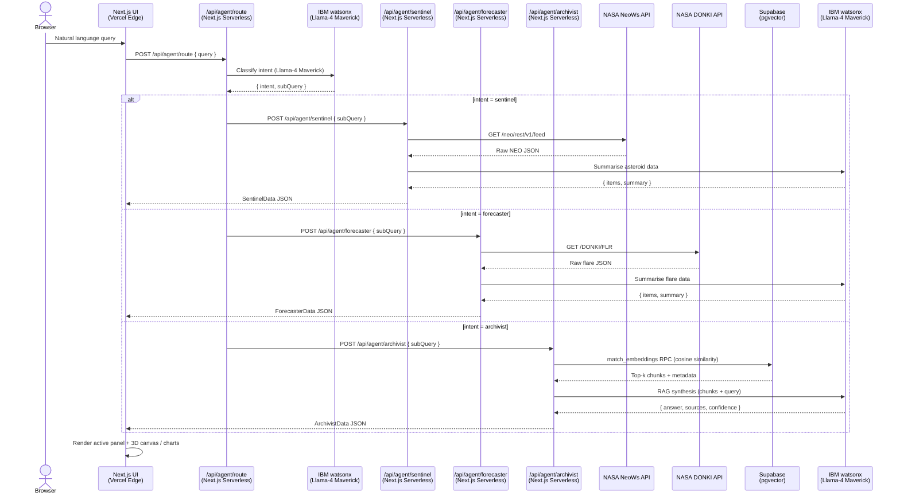

# ORION V2 — Engineering Roadmap
## Orbital Research & Intelligence Orchestration Network — Serverless Cloud-Native Architecture
### IBM AI Builders Challenge — Feature Branch: `feature/orion-v2-architecture`

---

## Executive Summary

ORION V1 delivered a working multi-agent space intelligence dashboard backed by a local Langflow server tunnelled via ngrok. V2 eliminates every local dependency and moves to a **100% serverless, cloud-native architecture**:

- **Langflow removed** — replaced by Next.js serverless route handlers that call IBM watsonx directly
- **Chroma local DB removed** — replaced by Supabase PostgreSQL + pgvector with cosine similarity RPCs
- **Three.js orbital canvas** — live 3D asteroid trajectory rendering inside the Sentinel widget
- **Recharts solar time-series** — interactive historical flare classification charts in the Forecaster widget
- **Multi-agent data fusion** — compound cross-agent queries with shared context across all three agents

The result is a zero-ops deployment: `git push` → Vercel builds → live globally, no local processes required.

---

## Phase Overview

| Phase | Name | Pillar | Status |
|-------|------|--------|--------|
| 1 | Serverless Migration | Rip out Langflow, wire watsonx directly | [ ] pending |
| 2 | Cloud Vector Database | Supabase + pgvector, migrate Chroma corpus | [ ] pending |
| 3 | 3D Orbital Canvas | Three.js asteroid trajectory rendering | [ ] pending |
| 4 | Solar Weather Charts | Recharts flare time-series visualisation | [ ] pending |
| 5 | Multi-Agent Data Fusion | Cross-agent compound query pipeline | [ ] pending |

---

## Architecture Diagram

Full serverless request lifecycle — from browser query to rendered panel:



---

## Pillar 1 — Serverless Migration (Ripping Out Local Backend)

### What changes

| V1 | V2 |
|----|----|
| Langflow local server (`localhost:7861`) | Next.js serverless route handlers |
| ngrok tunnel for Vercel → Langflow | Direct HTTPS from Vercel to watsonx + NASA |
| `LANGFLOW_URL`, `LANGFLOW_FLOW_ID` env vars | `WATSONX_API_KEY`, `WATSONX_PROJECT_ID`, `WATSONX_URL` env vars |
| Python custom components in `langflow/components/` | TypeScript fetch logic inside API routes |

### New file structure

```
frontend/src/app/api/agent/
├── route.ts          ← Master router (intent classification via watsonx)
├── sentinel/
│   └── route.ts      ← NeoWs fetch + watsonx summary
├── forecaster/
│   └── route.ts      ← DONKI fetch + watsonx summary
└── archivist/
    └── route.ts      ← Supabase pgvector retrieval + watsonx RAG synthesis
```

The existing `/api/chat/route.ts` is replaced entirely by this four-file structure. Each route is independently deployable and independently testable.

### Master Router (`/api/agent/route.ts`)

**Responsibility:** Receive the raw user query, call IBM watsonx Llama-4 Maverick for intent classification, forward to the correct sub-agent route, and return the structured response.

**watsonx REST call:**
```
POST https://us-south.ml.cloud.ibm.com/ml/v1/text/generation?version=2023-05-29
Authorization: Bearer <IAM token>
Body: {
  model_id: "meta-llama/llama-4-maverick-17b-128e-instruct-fp8",
  input: "<routing prompt>",
  parameters: { max_new_tokens: 128, temperature: 0 }
}
```

**IAM token refresh:** IBM watsonx uses short-lived IAM bearer tokens (1 hour TTL). The route handler must exchange `WATSONX_API_KEY` for a bearer token via `POST https://iam.cloud.ibm.com/identity/token` and cache it in a module-level variable with expiry tracking. Re-fetch only when within 60 seconds of expiry.

**Routing prompt (system):**
```
You are an intent classifier for ORION Space Command.
Classify the user query into exactly one of: sentinel, forecaster, archivist.
Return only valid JSON: {"intent": "sentinel"|"forecaster"|"archivist", "query": "<refined query>"}
```

### Sentinel Sub-Agent (`/api/agent/sentinel/route.ts`)

- Fetches NASA NeoWs `GET /neo/rest/v1/feed` (7-day window) directly from the serverless function
- Flattens `near_earth_objects[date][]` into a typed `AsteroidItem[]` array (same shape as V1)
- Calls watsonx Llama-4 Maverick with the flattened data for a natural-language summary
- Returns `SentinelData` JSON — identical contract to V1 so the frontend panel requires zero changes

### Forecaster Sub-Agent (`/api/agent/forecaster/route.ts`)

- Fetches NASA DONKI `GET /DONKI/FLR` (30-day lookback) directly
- Handles null response for quiet solar periods
- Calls watsonx for summary synthesis
- Returns `ForecasterData` JSON

### Archivist Sub-Agent (`/api/agent/archivist/route.ts`)

- Calls Supabase `match_embeddings` RPC (see Pillar 2) with the query embedded via watsonx embedding endpoint
- Passes top-k chunks to watsonx Llama-4 Maverick for RAG synthesis
- Returns `ArchivistData` JSON with `answer`, `sources`, `confidence`

### Environment variables (Vercel — V2)

| Variable | Description |
|----------|-------------|
| `WATSONX_API_KEY` | IBM Cloud API key |
| `WATSONX_PROJECT_ID` | watsonx.ai project ID |
| `WATSONX_URL` | `https://us-south.ml.cloud.ibm.com` |
| `NASA_API_KEY` | NASA Open APIs key |
| `NEXT_PUBLIC_SUPABASE_URL` | Supabase project URL |
| `SUPABASE_SERVICE_ROLE_KEY` | Supabase service role key (server-side only) |

`LANGFLOW_URL`, `LANGFLOW_FLOW_ID`, `SENTINEL_FLOW_ID`, `FORECASTER_FLOW_ID`, `ARCHIVIST_FLOW_ID`, and `LANGFLOW_API_KEY` are all removed.

### Todo list

1. Create `frontend/src/lib/watsonx.ts` — IAM token exchange + cached bearer token helper + `generateText()` wrapper
2. Create `frontend/src/app/api/agent/route.ts` — intent router
3. Create `frontend/src/app/api/agent/sentinel/route.ts` — NeoWs + watsonx
4. Create `frontend/src/app/api/agent/forecaster/route.ts` — DONKI + watsonx
5. Create `frontend/src/app/api/agent/archivist/route.ts` — Supabase + watsonx RAG
6. Update `frontend/src/app/page.tsx` — change fetch target from `/api/chat` to `/api/agent/route`
7. Delete `frontend/src/app/api/chat/route.ts`
8. Update Vercel env vars — remove Langflow vars, add watsonx + Supabase vars
9. Smoke test all three agents end-to-end on Vercel preview branch

---

## Pillar 2 — Cloud Vector Database (Supabase + pgvector)

### Why Supabase

Chroma in V1 runs on the local filesystem (`./data/chroma_db/`) — it cannot be accessed from Vercel serverless functions. Supabase provides a managed PostgreSQL instance with the `pgvector` extension, accessible over HTTPS from any serverless function globally.

### PostgreSQL Schema

```sql
-- Enable pgvector extension
CREATE EXTENSION IF NOT EXISTS vector;

-- Research embeddings table (replaces Chroma collection)
CREATE TABLE research_embeddings (
  id          BIGSERIAL PRIMARY KEY,
  source      TEXT NOT NULL,           -- e.g. "solar_flare_forecasting_ml (arXiv:2209.00789)"
  chunk_index INTEGER NOT NULL,        -- position within source document
  content     TEXT NOT NULL,           -- raw chunk text (512 chars)
  embedding   VECTOR(384) NOT NULL,    -- all-MiniLM-L6-v2 produces 384-dim vectors
  created_at  TIMESTAMPTZ DEFAULT NOW()
);

-- Telemetry logs table (optional — for storing query history and agent routing decisions)
CREATE TABLE telemetry_logs (
  id          BIGSERIAL PRIMARY KEY,
  session_id  UUID NOT NULL,
  query       TEXT NOT NULL,
  intent      TEXT NOT NULL,           -- sentinel | forecaster | archivist | fusion
  agent_ms    INTEGER,                 -- agent response time in milliseconds
  created_at  TIMESTAMPTZ DEFAULT NOW()
);

-- HNSW index for fast cosine similarity search
CREATE INDEX ON research_embeddings
  USING hnsw (embedding vector_cosine_ops)
  WITH (m = 16, ef_construction = 64);
```

### Cosine Similarity RPC

A Supabase PostgreSQL function exposed as an RPC endpoint — callable from the serverless Archivist route via the Supabase JS client:

```sql
CREATE OR REPLACE FUNCTION match_embeddings(
  query_embedding VECTOR(384),
  match_count     INTEGER DEFAULT 5,
  match_threshold FLOAT DEFAULT 0.3
)
RETURNS TABLE (
  id      BIGINT,
  source  TEXT,
  content TEXT,
  similarity FLOAT
)
LANGUAGE SQL STABLE AS $$
  SELECT
    id,
    source,
    content,
    1 - (embedding <=> query_embedding) AS similarity
  FROM research_embeddings
  WHERE 1 - (embedding <=> query_embedding) > match_threshold
  ORDER BY embedding <=> query_embedding
  LIMIT match_count;
$$;
```

### Migration Strategy — Chroma → Supabase

The 939 chunks currently in `./data/chroma_db/` need to be re-embedded and inserted into Supabase. A one-time migration script at `scripts/migrate_chroma_to_supabase.py`:

**Step 1 — Extract from Chroma:**
```python
client = chromadb.PersistentClient(path="./data/chroma_db")
collection = client.get_collection("archivist")
results = collection.get(include=["documents", "metadatas", "embeddings"])
```

**Step 2 — Insert into Supabase in batches:**
```python
from supabase import create_client
supabase = create_client(SUPABASE_URL, SUPABASE_SERVICE_ROLE_KEY)

BATCH = 50
for i in range(0, len(docs), BATCH):
    rows = [
        {
            "source": metas[i+j]["source"],
            "chunk_index": j,
            "content": docs[i+j],
            "embedding": embeddings[i+j],  # already 384-dim from all-MiniLM-L6-v2
        }
        for j in range(min(BATCH, len(docs) - i))
    ]
    supabase.table("research_embeddings").insert(rows).execute()
```

**Step 3 — Verify:**
```python
count = supabase.table("research_embeddings").select("id", count="exact").execute()
print(f"Migrated {count.count} chunks")  # expected: 939
```

After migration, `./data/chroma_db/` and the `chromadb` / `sentence-transformers` Python dependencies are no longer required at runtime. They remain in `requirements.txt` only for the one-time migration script.

### Query flow in V2 Archivist route

1. Receive `subQuery` string
2. Call watsonx embedding endpoint to get a 384-dim vector for the query
3. Call Supabase `match_embeddings` RPC with the vector
4. Receive top-5 chunks with source metadata
5. Pass chunks + query to watsonx Llama-4 Maverick for RAG synthesis
6. Return `ArchivistData` response

### Todo list

1. Create Supabase project — enable `pgvector` extension in the SQL editor
2. Run schema SQL — create `research_embeddings` and `telemetry_logs` tables + HNSW index
3. Create `match_embeddings` RPC function in Supabase SQL editor
4. Write `scripts/migrate_chroma_to_supabase.py` — extract Chroma → insert Supabase
5. Run migration — verify 939 rows in `research_embeddings`
6. Add `NEXT_PUBLIC_SUPABASE_URL` and `SUPABASE_SERVICE_ROLE_KEY` to Vercel env vars
7. Install `@supabase/supabase-js` in `frontend/`
8. Test `match_embeddings` RPC from the Archivist serverless route

---

## Pillar 3 — 3D Orbital Canvas (Three.js / @react-three/fiber)

### Vision

The Sentinel panel currently renders a flat HTML table of asteroid data. In V2, a live **3D orbital canvas** is embedded directly inside the Sentinel widget — showing Earth at the centre, with asteroid trajectories rendered as arcs in real time based on the NeoWs miss distance and close approach data.

### Technology

| Library | Role |
|---------|------|
| `@react-three/fiber` | React renderer for Three.js — declarative 3D scene graph |
| `@react-three/drei` | Helpers: `OrbitControls`, `Stars`, `Sphere`, `Line` |
| `three` | Core WebGL engine |

### Scene design

- **Earth** — textured sphere at origin (`radius=1`), slow axial rotation
- **Orbital reference plane** — faint grid ring at the ecliptic
- **Asteroid trajectories** — each asteroid rendered as a `<Line>` arc from approach vector to miss distance point, coloured by hazard status (red = PHO, cyan = safe)
- **Asteroid nodes** — small `<Sphere>` at the closest approach point, size scaled logarithmically by estimated diameter
- **Miss distance scale** — 1 Three.js unit = 1 lunar distance (384,400 km) for intuitive spatial comprehension
- **Camera** — `OrbitControls` enabled so the user can rotate/zoom the scene
- **Stars background** — `<Stars>` from drei for the space environment

### Component structure

```
frontend/src/components/
└── OrbitalCanvas.tsx     ← new — React Three Fiber scene
    ├── EarthSphere
    ├── AsteroidTrajectory (per asteroid item)
    └── OrbitalGrid
```

`SentinelPanel.tsx` renders `<OrbitalCanvas items={data.items} />` above the data table when data is present, or shows the existing `RadarIdle` animation when no data is loaded.

### Data mapping — NeoWs → 3D coordinates

NeoWs provides `miss_distance_km` and `relative_velocity_kmh` but not full orbital elements. For V2, a simplified 2D orbital plane projection is used:

- Each asteroid is assigned an approach angle derived from its `close_approach_date` (day-of-year → angle on ecliptic)
- Miss distance maps directly to the radial distance from Earth in the scene
- Trajectory arc is drawn as a Bezier curve from a point at 5 LD (lunar distances) inbound to the miss distance point

Full Keplerian orbital elements can be added in V3 when the NASA Small-Body Database API is integrated.

### Performance considerations

- Canvas is rendered only when `data` is non-null — idle state shows the existing SVG radar sweep
- `@react-three/fiber` uses `frameloop="demand"` to avoid continuous re-renders when the scene is static
- Asteroid geometries are instanced (`<InstancedMesh>`) when count > 20 to keep GPU load minimal
- Canvas is wrapped in `React.Suspense` with the skeleton fallback

### Todo list

1. `npm install three @react-three/fiber @react-three/drei` in `frontend/`
2. Create `frontend/src/components/OrbitalCanvas.tsx` — full scene with Earth, trajectories, controls
3. Update `SentinelPanel.tsx` — render `<OrbitalCanvas>` above table when data present
4. Add `"transpilePackages": ["three"]` to `next.config.js` for SSR compatibility
5. Test on Vercel preview — confirm WebGL loads correctly in production build

---

## Pillar 4 — Solar Weather Time-Series Charts (Recharts)

### Vision

The Forecaster panel currently renders flare events as static cards. In V2, an **interactive time-series chart** is embedded at the top of the Forecaster widget — showing flare classification frequency over the 30-day window as a bar chart with colour-coded severity bands, plus a scatter plot of peak intensity over time.

### Technology

| Library | Role |
|---------|------|
| `recharts` | React charting library — composable, responsive, lightweight |

Recharts is preferred over D3 directly because it integrates cleanly with React state and requires no imperative DOM manipulation.

### Chart design

**Chart 1 — Flare Frequency Bar Chart**
- X-axis: date (daily buckets over the 30-day period)
- Y-axis: count of flare events per day
- Bars colour-coded by most severe class that day: X=red, M=orange, C=yellow, B/A=grey
- Tooltip shows date + count + highest class on hover

**Chart 2 — Flare Class Scatter Plot**
- X-axis: `begin_time` (continuous timeline)
- Y-axis: numeric flare intensity (X=4, M=3, C=2, B=1, A=0)
- Each dot coloured by class with a glow effect matching the glassmorphic dark theme
- Clicking a dot opens the existing `DetailPanel` drawer for that flare event

### Component structure

```
frontend/src/components/
└── FlareChart.tsx    ← new — Recharts time-series visualisation
    ├── FlareFrequencyBar
    └── FlareScatter
```

`ForecasterPanel.tsx` renders `<FlareChart items={data.items} />` above the existing flare cards when data is present.

### Theming

Recharts components are fully customisable. All chart colours use the existing CSS design tokens (`--amber`, `--red`, `--cyan`, `--muted`, `--border`) for visual consistency with the glassmorphic theme.

### Todo list

1. `npm install recharts` in `frontend/`
2. Create `frontend/src/components/FlareChart.tsx` — frequency bar + scatter plot
3. Update `ForecasterPanel.tsx` — render `<FlareChart>` above flare cards when data present
4. Verify responsive behaviour at all three breakpoints (mobile, tablet, desktop)
5. Test on Vercel preview

---

## Pillar 5 — Multi-Agent Data Fusion

### Vision

V1 routes every query to exactly one agent. V2 introduces **compound queries** that require cross-agent context — for example:

> *"Is solar activity this week correlated with any of the approaching asteroids?"*

This query needs data from both the Forecaster (solar radiation levels) and the Sentinel (asteroid orbital coordinates), fused before the Archivist generates a synthesis report grounded in the research corpus.

### Fusion intent classification

The master router is extended with a fourth intent class: `fusion`. The routing prompt is updated:

```
Classify the user query into exactly one of:
  sentinel   — near-Earth object / asteroid queries
  forecaster — solar weather / flare queries
  archivist  — astrophysics research / literature queries
  fusion     — compound queries requiring data from multiple agents

Return only valid JSON:
{
  "intent": "sentinel"|"forecaster"|"archivist"|"fusion",
  "query": "<refined query>",
  "agents": ["sentinel", "forecaster"]   // only present when intent = fusion
}
```

### Fusion pipeline (`/api/agent/fusion/route.ts`)

```
1. Parse agents[] from router response
2. Fan out: call each required sub-agent route in parallel (Promise.all)
3. Collect structured responses from all agents
4. Build a fusion context block:
   - Sentinel data summary
   - Forecaster data summary
   - (optionally) Archivist RAG chunks for background
5. Call watsonx Llama-4 Maverick with the fusion context + original query
6. Return a FusionData response:
   {
     intent: "fusion",
     agents: ["sentinel", "forecaster"],
     sentinel: SentinelData,
     forecaster: ForecasterData,
     synthesis: string,   // cross-agent narrative from watsonx
     sources: string[]
   }
```

### Frontend rendering

A new `FusionPanel.tsx` component renders compound results — showing a split view with both agent data panels active simultaneously, plus a synthesis narrative block below. The existing three panels dim when `intent === "fusion"` and the fusion panel slides in.

### Correlation example — solar radiation vs asteroid approaches

The fusion prompt for a solar-asteroid correlation query:

```
You are ORION's multi-agent analyst. Using the following data:

SOLAR ACTIVITY (last 30 days):
{forecaster_summary}
Peak flare class: {peak_class}
Active flare periods: {active_dates}

ASTEROID APPROACHES (next 7 days):
{sentinel_summary}
Closest approach: {closest_asteroid} at {miss_distance} km on {approach_date}

Analyse whether any approaching asteroids pass through periods of elevated solar
radiation that could affect trajectory prediction accuracy or mission planning.
Cite relevant factors from space weather physics.
```

### Todo list

1. Update `/api/agent/route.ts` — add `fusion` intent class + `agents[]` field to router
2. Create `frontend/src/app/api/agent/fusion/route.ts` — parallel fan-out + watsonx synthesis
3. Create `frontend/src/components/FusionPanel.tsx` — split-view compound result renderer
4. Update `frontend/src/app/page.tsx` — handle `intent === "fusion"` result type
5. Write fusion prompt templates for the three most common compound query patterns
6. End-to-end test: `"correlate solar activity with asteroid approaches this week"`

---

## Cross-Cutting V2 Notes

### No local processes required

After V2 is complete, the only thing needed to run ORION is:
```
git push origin main
```
No `python -m langflow run`. No `ngrok http 7861`. No local Python environment at runtime.

### Secrets hygiene

All new secrets (`WATSONX_API_KEY`, `WATSONX_PROJECT_ID`, `SUPABASE_SERVICE_ROLE_KEY`) are server-side only — never prefixed with `NEXT_PUBLIC_` and never exposed to the browser bundle. The Supabase URL uses `NEXT_PUBLIC_SUPABASE_URL` only because it is a non-sensitive endpoint identifier.

### Backwards compatibility

The V2 API response shapes (`SentinelData`, `ForecasterData`, `ArchivistData`) are identical to V1. All five frontend panel components (`SentinelPanel`, `ForecasterPanel`, `ArchivistPanel`, `TelemetryConsole`, `DetailPanel`) require zero changes in Pillars 1 and 2. New components (`OrbitalCanvas`, `FlareChart`, `FusionPanel`) are purely additive.

### Branch strategy

```
main                          ← V1 locked, live on Vercel
└── feature/orion-v2-architecture
    ├── pillar/1-serverless-migration
    ├── pillar/2-supabase-pgvector
    ├── pillar/3-orbital-canvas
    ├── pillar/4-flare-charts
    └── pillar/5-multi-agent-fusion
```

Each pillar is developed on its own sub-branch and merged into `feature/orion-v2-architecture` via PR before the full V2 is merged to `main`.

### Dependency additions (frontend)

| Package | Pillar | Purpose |
|---------|--------|---------|
| `@supabase/supabase-js` | 2 | Supabase client — pgvector RPC calls |
| `three` | 3 | WebGL 3D engine |
| `@react-three/fiber` | 3 | React renderer for Three.js |
| `@react-three/drei` | 3 | Three.js helpers (OrbitControls, Stars, etc.) |
| `recharts` | 4 | React charting for solar weather time-series |

### Dependency removals (Python — runtime only)

| Package | Reason |
|---------|--------|
| `langflow` | Replaced by Next.js serverless routes |
| `chromadb` | Replaced by Supabase pgvector (kept for migration script) |
| `sentence-transformers` | Replaced by watsonx embedding endpoint (kept for migration script) |
| `langchain` | No longer needed |
| `langchain-ibm` | No longer needed |

`docling`, `requests`, and `ibm-watsonx-ai` remain for the one-time migration tooling.
